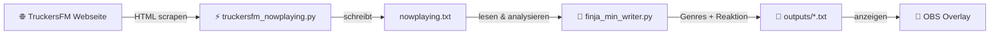

# 🚚 Finja-Music: TruckersFM

*Live NowPlaying von TruckersFM → Finjas Musikgehirn → Genres & Reaktionen → OBS Overlay*

---

## ✨ Was ist das?

Dieses Projekt besteht aus **zwei Teilen**, die zusammenarbeiten, um Live-Musikinformationen von TruckersFM in ein dynamisches OBS-Overlay für deinen Stream zu verwandeln.

-   **⚡ Teil 1: TRUCKERSFM – GET CONTENT** Ein Scraper holt den aktuell gespielten Song von der TruckersFM-Website und schreibt den Titel in die Datei `nowplaying.txt`.

-   **🧠 Teil 2: Musik (Finjas Musikgehirn)** Dieses Skript liest die `nowplaying.txt`, gleicht den Song mit deiner persönlichen Song-Datenbank ab, generiert passende Genres und eine einzigartige Finja-Reaktion. Das Ergebnis wird in zwei Textdateien für OBS geschrieben.

> **Zusammengefasst:** Teil 1 liefert den Songtitel, Teil 2 macht daraus den Content für dein OBS-Overlay. 💖

---

## 🗺️ Architektur & Setup

### Workflow



### Ordnerstruktur

```plaintext
Finja-music/
└─ TruckersFM/
   ├─ TRUCKERSFM - GET CONTENT/      # Teil 1 (holt NowPlaying)
   │   ├─ truckersfm_nowplaying.py
   │   ├─ start_nowplaying_windows.bat
   │   ├─ NowPlaying_TFM_Bright.html
   │   ├─ nowplaying.txt
   │   └─ outputs/
   │      ├─ obs_genres.txt
   │      └─ obs_react.txt
   │
   └─ Musik/                         # Teil 2 (Finjas Musikgehirn)
       ├─ finja_min_writer.py
       ├─ build_spotify_kb_only.py
       ├─ spotify_enrich_missing.py
       ├─ kb_probe.py
       ├─ config_min.json
       ├─ run_finja.bat
       ├─ SongsDB/
       └─ Memory/
```

### 🚀 Quick Start (Windows)

1.  **Teil 1 starten:** Führe `TRUCKERSFM - GET CONTENT/start_nowplaying_windows.bat` aus. Dieses Skript läuft im Hintergrund und aktualisiert die `nowplaying.txt`, sobald ein neuer Song auf TruckersFM gespielt wird.
2.  **Teil 2 starten:** Führe `Musik/run_finja.bat` aus. Das Musikgehirn wacht nun über die `nowplaying.txt` und erzeugt bei Änderungen die Output-Dateien für OBS.
3.  **In OBS einrichten:** Füge eine neue **Browser-Quelle** hinzu, wähle **"Lokale Datei"** und verweise auf `TRUCKERSFM - GET CONTENT/NowPlaying_TFM_Bright.html`.

> **⚠️ Wichtig:** Durch diesen Aufbau wirkt es, als würde Finja „wirklich zuhören“. Teil 1 holt die Song-Info, sobald sie verfügbar ist, und Teil 2 reagiert sofort darauf – selbst wenn du den Stream nicht aktiv hörst. Für ein synchrones Erlebnis kannst du TruckersFM einfach im Browser mitlaufen lassen.

### Konfiguration des OBS Overlays

Passe in der Datei `Musik/config_min.json` die Pfade an, damit das Musikgehirn die richtigen Dateien findet und beschreibt:
```json
{
  "input_path": "../TRUCKERSFM - GET CONTENT/nowplaying.txt",
  "fixed_outputs": "../TRUCKERSFM - GET CONTENT/outputs",
}
```

---

## ⚙️ Funktionsweise im Detail

### `.bat`-Dateien (Start-Skripte)

-   `start_nowplaying_windows.bat`: Startet den Crawler (Teil 1), der die `nowplaying.txt` atomar schreibt (verhindert Lese-/Schreibkonflikte).
-   `run_finja.bat`: Startet Finjas Musikgehirn (Teil 2), das die Dateien `obs_genres.txt` & `obs_react.txt` erzeugt.

### `.lock`-Datei (Schutz vor Doppelinstanz)

-   Beim Start erstellt `finja_min_writer.py` eine `finja_min_writer.lock`-Datei.
-   Diese verhindert, dass das Skript versehentlich zweimal gestartet wird.
-   Bei einem sauberen Beenden mit `Strg + C` wird die `.lock`-Datei automatisch gelöscht.
-   **Bei einem Absturz:** Lösche die `.lock`-Datei manuell mit dem Befehl `del finja_min_writer.lock`.

### Integrität & Caching (SHA-256)

-   Die Song-Datenbank (`songs_kb.json`) wird beim Start in den Arbeitsspeicher geladen und ihr Inhalt gehasht (SHA-256).
-   Die OBS-Textdateien werden nur dann überschrieben, wenn sich der Hash des Inhalts ändert. Das verhindert unnötiges Flackern im Overlay.
-   Das System speichert nur neue Erinnerungen, wenn ein Hash-Mismatch auftritt, was Duplikate vermeidet.

---

## 🎧 Spotify-Tools: Deine Song-Datenbank pflegen

### `build_spotify_kb_only.py`

-   **Zweck:** Erstellt oder erweitert deine zentrale `songs_kb.json` aus CSV-Dateien, die du aus Spotify exportiert hast.
-   **Features:** Führt Duplikat-Prüfungen durch (Groß-/Kleinschreibung wird ignoriert) und erstellt automatisch Aliase.
-   **Beispiel:**
    ```bash
    python build_spotify_kb_only.py --kb SongsDB/songs_kb.json --inputs exports/*.csv --inplace --pretty
    ```

### `spotify_enrich_missing.py`

-   **Zweck:** Findet Songs, die im Log `missing_songs_log.jsonl` gelandet sind (weil sie nicht in deiner DB waren) und reichert sie automatisch mit Daten von der Spotify-API an.
-   **Features:** Holt Genres, Alben und weitere Künstler und fügt die vervollständigten Songs zur Datenbank hinzu.
-   **Beispiel:**
    ```bash
    python spotify_enrich_missing.py --verbose --update-existing
    ```
-   ⚠️ **Wichtig:** Du musst deine **Spotify-Client-ID & Secret** in einer `.env`-Datei angeben. Zudem muss ein Spotify-Gerät aktiv sein (z.B. die App geöffnet und einmal kurz auf Play gedrückt).

### `kb_probe.py`

-   **Zweck:** Ein Debug-Tool, um zu testen, wie Finjas Musikgehirn auf einen bestimmten Songtitel reagieren würde.
-   **Beispiel:**
    ```bash
    python kb_probe.py --line "Song — Artist" --kb SongsDB/songs_kb.json
    ```

---

## 🧯 Troubleshooting

-   **`nowplaying.txt` ist leer?**
    -   Läuft Teil 1 (`start_nowplaying_windows.bat`)?
    -   Besteht eine Internetverbindung?
-   **Genre-Ausgabe ist leer?**
    -   Existiert die `songs_kb.json`?
    -   Sind die Pfade in `config_min.json` korrekt?
-   **Overlay im OBS ist leer?**
    -   Ist die Browser-Quelle korrekt auf die `NowPlaying_TFM_Bright.html` Datei ausgerichtet?
-   **Fehler wegen doppelter Instanz?**
    -   Lösche die `finja_min_writer.lock`-Datei manuell.

---

## 📜 Lizenz

Dieses Projekt steht unter der **MIT-Lizenz** — gebaut mit Mate, Liebe & ein bisschen Chaos.

---

## 🆘 Support & Kontakt

-   **E-Mail:** contact@jappshome.de
-   **Website:** [jappshome.de](https://jappshome.de)
-   **Unterstützung:** [Buy Me a Coffee](https://buymeacoffee.com/J.Apps)

---
> Finja sagt: „Stay hydrated, Chat 💧“