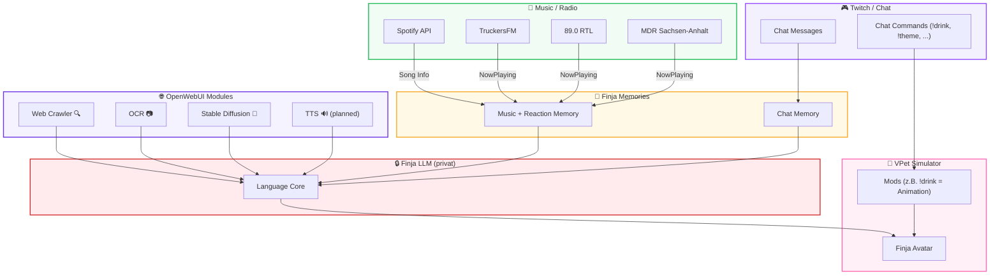

---

📄 **README.md**

```markdown
███████╗██╗███╗   ██╗     ██╗ █████╗ 
██╔════╝██║████╗  ██║     ██║██╔══██╗
█████╗  ██║██╔██╗ ██║     ██║███████║
██╔══╝  ██║██║╚██╗██║██   ██║██╔══██║
██║     ██║██║ ╚████║╚█████╔╝██║  ██║
╚═╝     ╚═╝╚═╝  ╚═══╝ ╚════╝ ╚═╝  ╚═╝
      F I N J A   A I   E C O S Y S T E M
```

---

# ✨ Finja AI Ecosystem

Dein Hybrid-KI-Buddy fürs Streaming – mit Chatbot, Musikengine, Memories, Mods und einem geheimen LLM-Core.

---

## 🤖 What’s Finja?

Finja ist kein einzelner Bot, sondern ein **komplettes Ökosystem**.
Jedes Modul kann **standalone** laufen – aber nur zusammen ergibt’s die volle **Finja-Experience**.

* **Standalone möglich**: Musikengine, Chatbot, Crawler usw. einzeln nutzbar
* **Full Package = Finja**: erst die Kombi formt ihre Persönlichkeit
* **LLM bleibt geheim**: läuft nur im VPet-Simulator, nicht veröffentlicht 🫣

---

## 🧩 Projektübersicht

### 💬 1. Chatbot

* Integration in Twitch-Chat
* Commands werden **ausgeführt** (`!drink`, `!theme`, `!help`)
* Feedback im Chat: “✅ Done” oder “❌ Nope” + kleine Reaction
* Langzeitgedächtnis für User + Stream

---

### 🎵 2. Musik + Radio (mit Memory)

* Song/Genre-Erkennung (Spotify, TruckersFM, 89.0 RTL, MDR …)
* Merkt sich Reaktionen zu Songs/Genres
* 600+ dynamische Reaktionen (von wholesome bis meme)
* Kontextabhängig: Minecraft ≠ ETS2 ≠ Chill

---

### 🌐 3. OpenWebUI-Module

* **3.1 Chat-Memory** – Langzeitgedächtnis für Streams, User & Facts
* **3.2 Web Crawler** – Infosuche via TOR mit Google-Fallback
* **3.3 OCR** – Text aus Bildern lesen
* **3.4 Stable Diffusion** – Bilder generieren
* **3.5 TTS (planned)** – Stimme für Finja

---

### 🔒 4. Finja LLM (privat)

* Läuft **nur im VPet-Simulator** als Mod
* Bindet via OpenWebUI an Module an
* Bleibt **geschlossen / nicht veröffentlicht**

---

### 🐾 5. VPet-Simulator Integration

* **5.1 Chat-Commands als echte Aktionen** (`!drink` → Finja kriegt was zu trinken)
* **5.2 Mehr Mods** für zusätzliche Interaktionen

---

## 🚀 Architektur – Föderiert & Hybrid

* **Rule-Engines** → stabil & schnell
* **Module** → separat oder kombiniert nutzbar
* **LLM (privat)** → nur fürs VPet, nicht Teil des Repos

---

## 🗺️ Finja Architektur – Visual Flow



---

## 📂 Repo-Struktur

* `/finja-chat` → Twitch Chatbot
* `/finja-music` → Musikengine + Radio + Memory
* `/finja-memory` → Chat- & Musik-Memory
* `/finja-web-crawler` → Websuche (TOR/Google)
* `/finja-ocr` → OCR-Modul
* `/finja-stable-diffusion` → Bildgenerierung
* `/finja-tts` → Sprachmodul (geplant)

---

## 🛠️ Getting Started

**Requirements:**

* Python 3.9+
* Docker (optional)

```bash
git clone https://github.com/DeinUsername/finja-ai-ecosystem.git
cd finja-ai-ecosystem
```

Dann ins Modul deiner Wahl springen & README lesen.

---

## 📜 License

MIT-License.
Alle Module sind Open-Source – das **LLM bleibt privat**.

---

## ❤️ Credits

Built mit zu viel Mate, Coding-Sessions & Liebe by **J. Apps**.
Finja sagt: *“Stay hydrated, Chat 💖”*

```
