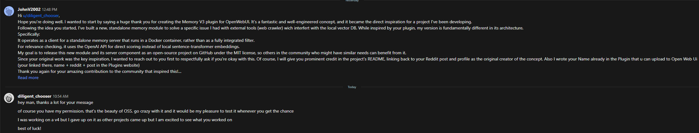

```
███████╗██╗███╗   ██╗     ██╗ █████╗ 
██╔════╝██║████╗  ██║     ██║██╔══██╗
█████╗  ██║██╔██╗ ██║     ██║███████║
██╔══╝  ██║██║╚██╗██║██   ██║██╔══██║
██║     ██║██║ ╚████║╚█████╔╝██║  ██║
╚═╝     ╚═╝╚═╝  ╚═══╝ ╚════╝ ╚═╝  ╚═╝
      F I N J A   A I   E C O S Y S T E M
```

---

> [!IMPORTANT]
> # ❄️ WINTER BREAK – SEE YOU IN 2026! ❄️
>
> **Status:** 🟡 *Maintenance Mode & Critical Fixes Only*
>
> Hey ho! "Finja" und ich gehen in eine kreative Winterpause bis zum **01.01.2026**.
>
> **Warum?**
> 1.  🚀 **The Big Picture:** Ich plane im Hintergrund etwas Großes – ein riesiges Upgrade für das Ökosystem. (Bin dabei endlich alles zu einem "Kopf" zu verbinden :D)
> 2.  🧠 **Mental Health & Quality:** Finja ist mir extrem wichtig. Damit das Projekt langfristig gut bleibt und ich die Vision für 2026 umsetzen kann, will ich kein halbherziges "Vibe Coding", sondern echte Qualität abliefern. Dafür brauche ich mentale Ruhe und Fokus.
>
> **Was bedeutet das für euch?**
> * Keine großen neuen Feature-Drops bis 2026.
> * 🚑 **Support läuft weiter:** Bei wirklichen Problemen, Bugs oder Sicherheitslücken bin ich natürlich da und pushe Updates!
>
> *Danke für euren Support. Stay hydrated! 💖*
> *„Sometimes you have to disconnect to reconnect.“ - Finja* 

---

### Build & Test Status

#### 🔨 Docker Builds
[](https://github.com/JohnV2002/Finja-AI-Ecosystem/actions/workflows/memory-build.yml)
[](https://github.com/JohnV2002/Finja-AI-Ecosystem/actions/workflows/ocr-build.yml)
[](https://github.com/JohnV2002/Finja-AI-Ecosystem/actions/workflows/web-crawler-build.yml)

#### ✅ Automated Tests
[](https://github.com/JohnV2002/Finja-AI-Ecosystem/actions/workflows/finja-chat-tests.yml)
[](https://github.com/JohnV2002/Finja-AI-Ecosystem/actions/workflows/openweb-ui-tests.yml)
[](https://github.com/JohnV2002/Finja-AI-Ecosystem/actions/workflows/music-engine-tests.yml)
[](https://github.com/JohnV2002/Finja-AI-Ecosystem/actions/workflows/code-quality.yml)
[](https://github.com/JohnV2002/Finja-AI-Ecosystem/actions/workflows/comprehensive-tests.yml)

---

### Links & Demos
-   **Blog:** [](https://doku.jappshome.de/blog)
-   **Documentation:** [](https://doku.jappshome.de)
-   **Besuche meine Website:** [](https://jappshome.de)
-   **Schau dir Finja live an **AB SOFORT 24/7 AUF TWITCH**:** [](https://www.twitch.tv/sodakiller1)
-   **Komm auf unseren Discord für mehr Projekte:** [](https://discord.com/invite/c55C6ggQ5K)
-   **TESTE FINJA, WÄHREND SIE OFFLINE IST (MIT MEMORY):** [](https://openwebui.jappshome.de)
-   **TESTE FINJA KOSTENLOS (OHNE MEMORY) UPDATED TO MoE Modell!:** [](https://jappshome.de/livetest.html)
---

# ✨ Finja AI Ecosystem

Dein Hybrid-KI-Buddy fürs Streaming – mit Chatbot, Musikengine, Memories, Mods und einem geheimen LLM-Core.

---

## 🤖 Was ist Finja?

Finja ist kein einzelner Bot, sondern ein **komplettes Ökosystem**. Jedes Modul kann **standalone** laufen – aber nur zusammen ergibt’s die volle **Finja-Experience**.

-   **Standalone möglich**: Musikengine, Chatbot, Crawler usw. sind einzeln nutzbar.
-   **Full Package = Finja**: Erst die Kombination formt ihre Persönlichkeit.
-   **LLM bleibt geheim**: Der Sprachkern läuft nur im VPet-Simulator und ist nicht Teil dieses Repositories. 🫣

---

## 📊 Projektstatus-Übersicht
*Stand: 1. Dec 2025*

| Hauptkomponente | Status | Bemerkungen |
| :--- | :--- | :--- |
| **finja-chat** | 🟢 Stabil | LLM-Support hinzugefügt, modularer gemacht |
| **finja-music** | 🟢 Stabil | Verschiedene Versionen verfügbar |
| &nbsp;&nbsp;└─ finja-everthing-in-once | 🟢 Stabil | Empfohlene Web-UI-Version |
| &nbsp;&nbsp;└─ finja-music-docker-spotify | 🟢 Stabil | Docker-Version nur für Spotify + gebraucht für die App |
| &nbsp;&nbsp;└─ finja-music-standalone | 🟢 Stabil | Klassisches modulares System |
| **finja-Open-Web-UI** | 🟢 Stabil | Module einsatzbereit |
| &nbsp;&nbsp;└─ finja-Memory | 🟢 Stabil | Updates erstmal Fertig |
| &nbsp;&nbsp;└─ finja-ocr | 🟢 Stabil | Funktioniert einwandfrei |
| &nbsp;&nbsp;└─ finja-stable-diffusion | 🟢 Stabil | Setup abgeschlossen, keine Tests |
| &nbsp;&nbsp;└─ finja-tts | 🟡 WIP | Gebaut und wird Getestet |
| **finja-app** | 🟡 WIP | Aktuell geplant, noch leer, Bringt ihre Reaction aufs handy! + Schreib mit ihr auf dem handy! |
| **OWN / Self made VPet!** | 🟡 WIP | Vergiss VPet Simulator und Windows Apps, Willkommen bei Python und ein Besseres Tomogatchi! mit allem was VPet auch konnte! |
| **VPet-Simulator Mods** | 🔴 NWO | Bald nicht mehr nötig! |

**Legende:** 🟢 Stabil | 🔵 Stabil (in Arbeit) | 🟡 WIP (in Planung) | 🔴 Not Working on it
---

## 🗺️ Finja Architektur – Visueller Flow


---

## 📂 Projektstruktur & Module

-   `/finja-chat` → Der Kern-Chatbot für die Twitch-Integration mit OBS-Overlay und Bot-Panel.
-   `/Finja-music` → Enthält alle Varianten der Musik-Engine. Du wählst **eine** davon aus:
    -   `/finja-everthing-in-once` → **(Empfohlen)** Bündelt alle Musikquellen (TruckersFM, Spotify etc.) und wird über eine komfortable Weboberfläche gesteuert.
    -   `/finja-music-docker-spotify` → Eine spezielle Docker-Version, die nur für Spotify optimiert ist.
    -   `/finja-music-standalone` → Das klassische, modulare System, bei dem jede Musikquelle in einem eigenen Ordner liegt und manuell per Skript gestartet wird.
-   `/finja-Open-Web-UI` → Sammlung von Docker-Modulen für OpenWebUI (Memory, OCR, Web Crawler etc.).
-   `/VPet-Simulator Mods` → Geplante Mods, um Aktionen im VPet-Simulator-Avatar auszulösen.

---

## 🧪 Testing & Quality Assurance

Das Finja-Ökosystem verfügt über eine umfassende Test-Suite, um Code-Qualität und Stabilität sicherzustellen.

### Test-Coverage
- **Unit Tests**: 150+ Test Cases für alle Haupt-Komponenten
- **Integration Tests**: API-Endpoints, Spotify-Integration, Memory-System
- **Security Tests**: Path-Traversal-Prevention, Auth-Validation
- **Code Quality**: Linting (flake8, black, isort), Security-Scanning (bandit, safety)

### Lokal testen
```bash
# Test-Dependencies installieren
pip install -r test-requirements.txt

# Alle Tests ausführen
pytest

# Mit Coverage-Report
pytest --cov=. --cov-report=html
```

📖 **Vollständige Test-Dokumentation**: [TESTING.md](./TESTING.md)

---

## 🚀 Der rote Faden – Empfohlener Start

Folge diesen Schritten, um das Finja-Ökosystem von Grund auf einzurichten.

### Vorbereitung
Stelle sicher, dass du **Git**, **Python 3.9+** und **Docker & Docker Compose** installiert hast. Klone dann dieses Repository.

### Schritt 1: Das Fundament legen (OpenWebUI-Module)
Die Backend-Dienste sind die Grundlage für Finjas erweiterte Fähigkeiten.
1.  Navigiere in das Verzeichnis `finja-Open-Web-UI/`.
2.  Folge der dortigen `README.md`, um die Docker-Container (besonders **Memory**, **Web Crawler** und **OCR**) zu starten.
3.  [➡️ **Zur Anleitung für die OpenWebUI-Module**](./finja-Open-Web-UI/README.md)

### Schritt 2: Das Musik-Gehirn zum Leben erwecken
Das Herzstück der Musikerkennung.
1.  Navigiere in das Verzeichnis `Finja-music/`.
2.  Hier hast du die Wahl. **Für die meisten Nutzer empfehlen wir die `finja-everthing-in-once`-Version.**
3.  Folge der `README.md` im `finja-everthing-in-once`-Ordner, um die Weboberfläche zu starten, deine API-Keys zu konfigurieren und deine Song-Datenbank aufzubauen.
4.  [➡️ **Zur Anleitung für die All-in-One Musik-Engine**](./Finja-music/finja-everthing-in-once/README.md)

### Schritt 3: Die Stimme geben (Chatbot)
Jetzt können wir die primäre Schnittstelle für die Interaktion einrichten.
1.  Navigiere in das Verzeichnis `finja-chat/`.
2.  Folge der dortigen `README.md`, um das **OBS Chat-Overlay** und das **Bot Control Panel** zu konfigurieren.
3.  [➡️ **Zur Anleitung für das Chat-System**](./finja-chat/README.md)

### Schritt 4: Die visuelle Form (VPet-Simulator)
Der letzte Schritt ist, Finja im VPet-Simulator zum Leben zu erwecken.
1.  Navigiere in das Verzeichnis `VPet-Simulator Mods/`.
2.  Folge der dortigen `README.md`, um die geplanten Mods zu verstehen.
3.  [➡️ **Zur Anleitung für die VPet-Mods**](./VPet-Simulator%20Mods/readme.md)

---

## 📜 License

MIT-License.
Alle Module sind Open-Source – das **LLM bleibt privat**.

---

## ❤️ THANKS

Ein riesiges Dankeschön an **Synk** 💻  
für die Hilfe beim Finden und Fixen von Vulnerabilities –  
und dafür, dass dieses Projekt **sicher & geschützt** bleibt 🛡️

---

Ein **dickes Dankeschön** an **gramanoid** (aka **diligent_chooser**) 🧠  
Er war meine Inspiration für das **Open WebUI Adaptive Memory Projekt**!  
Ohne ihn gäb’s Finjas Memory-System so nicht 💖

- [👤 Reddit-Profil](https://www.reddit.com/user/diligent_chooser/?utm_source=share&utm_medium=web3x&utm_name=web3xcss&utm_term=1&utm_content=share_button)
- [📄 Original Reddit-Post](https://www.reddit.com/r/OpenWebUI/comments/1kd0s49/adaptive_memory_v30_openwebui_plugin/)
- [🧩 Open WebUI Plugin-Seite](https://openwebui.com/f/alexgrama7/adaptive_memory_v2)

**Danke auch für die Freigabe unter Apache 2.0-Lizenz Habe Diese beibehalten! (NUR FÜR CHAT - MEMORY!) 💖**



---

Und natürlich auch Shoutout an  
**Vedal1987 + Neuro / Neurosamma + Evil** 💚  
für die ursprüngliche Idee, **AI-Companions beim Streamen** zu nutzen —  
ihr wart die Inspiration, das überhaupt zu versuchen 🫶

- [🎥 Twitch](https://www.twitch.tv/vedal987)
- [🌐 Vedal.ai (alle weiteren Links dort)](https://vedal.ai/)

---

### ☕ Supporter
Ein riesiges Dankeschön geht an alle, die das Projekt über [Buy Me a Coffee](https://buymeacoffee.com/J.Apps) unterstützen!

Ein ganz besonderer Dank geht an:
* **[Ithrial]** – für die allererste Spende! 🥇💖

---

## ❤️ Credits

Built mit zu viel Mate, Coding-Sessions & Liebe by **J. Apps**.
Finja sagt: *“Stay hydrated, Chat 💖”*

---

## 🆘 Support & Kontakt

-   **E-Mail:** contact@jappshome.de
-   **Website:** [jappshome.de](https://jappshome.de)
