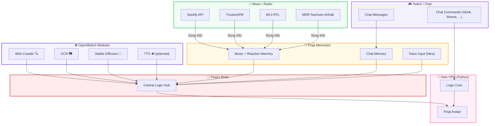

# ✨ Finja AI Ecosystem
```
███████╗██╗███╗   ██╗     ██╗ █████╗ 
██╔════╝██║████╗  ██║     ██║██╔══██╗
█████╗  ██║██╔██╗ ██║     ██║███████║
██╔══╝  ██║██║╚██╗██║██   ██║██╔══██║
██║     ██║██║ ╚████║╚█████╔╝██║  ██║
╚═╝     ╚═╝╚═╝  ╚═══╝ ╚════╝ ╚═╝  ╚═╝
      F I N J A   A I   E C O S Y S T E M
```

---

> [!IMPORTANT]
> # 🚀 ROADMAP 2026 – WE ARE BACK!
>
> **Status:** 🟢 *Active Development & New Features*
>
> 2026 ist da und Finja bekommt das größte Upgrade aller Zeiten. Hier ist der Plan für dieses Jahr:
>
> 1.  🛠️ **Quality First:** Ich überarbeite den Code fast einmal komplett manuell (+ Hilfe von Sonar), um echten Quality-Code zu liefern.
> 2.  🐛 **Bug-Hunting:** Diverse Fixes stehen an.
> 3.  🧠 **Memory Update:** Voice-Support ist hinzugefügt! (Checks müssen noch gemacht werden).
> 4.  🐾 **Own VPet Program:** Mein eigenes VPet ist in voller Bearbeitung!
>     * 👀 Kann ab sofort **24/7 auf Twitch** beobachtet werden.
>     * 📦 Release folgt, sobald es vollständig ist.
> 5.  🌐 **Finja's Brain:** Arbeit läuft – dieses Modul verknüpft endlich **ALLES** miteinander.
> 6.  😅 **Survival:** Nicht zusammenbrechen! XD
> 7.  🗣️ **Releases:** Finja TTS muss noch veröffentlicht werden.
> 8.  📚 **Tutorials & Guides:**
>     * Paperless-ngx + Paperless AI + API Tutorial.
>     * Home Assistant + API Tutorial.
> 9.  ✨ **Wildcard:** Alles, was mir übers Jahr noch so einfällt! :D

---

## 🤖 Was ist Finja?

Dein Hybrid-KI-Buddy fürs Streaming – mit Chatbot, Musikengine, Memories, Mods und einem geheimen LLM-Core.

Finja ist kein einzelner Bot, sondern ein **komplettes Ökosystem**. Jedes Modul kann **standalone** laufen – aber nur zusammen ergibt’s die volle **Finja-Experience**.

-   **Standalone möglich**: Musikengine, Chatbot, Crawler usw. sind einzeln nutzbar.
-   **Full Package = Finja**: Erst die Kombination formt ihre Persönlichkeit.
-   **LLM bleibt geheim**: Der Sprachkern läuft nur im VPet-Simulator und ist nicht Teil dieses Repositories. 🫣

---

## 📊 Projektstatus
*Stand: Januar 2026*

| Hauptkomponente | Status | Bemerkungen |
| :--- | :--- | :--- |
| **finja-chat** | 🟢 Stabil | LLM-Support integriert, modularisiert |
| **finja-music** | 🟢 Stabil | Verschiedene Versionen verfügbar |
| &nbsp;&nbsp;└─ finja-everthing-in-once | 🟢 Stabil | Empfohlene Web-UI-Version |
| &nbsp;&nbsp;└─ finja-music-docker-spotify | 🟢 Stabil | Docker-Version (Spotify only) |
| &nbsp;&nbsp;└─ finja-music-standalone | 🟢 Stabil | Klassisches modulares System |
| **finja-Open-Web-UI** | 🟢 Stabil | Module einsatzbereit |
| &nbsp;&nbsp;└─ finja-Memory | 🔵 Update | Voice hinzugefügt, Checks laufen |
| &nbsp;&nbsp;└─ finja-ocr | 🟢 Stabil | Funktioniert einwandfrei |
| &nbsp;&nbsp;└─ finja-stable-diffusion | 🟢 Stabil | Setup fertig, Tests fehlen |
| &nbsp;&nbsp;└─ finja-tts | 🟡 WIP | Release geplant |
| **OWN / Self made VPet** | 🟡 Dev | **LIVE auf Twitch!** Eigener Python-Core, ersetzt VPet-Sim. |
| **Finja's Brain** | 🟡 WIP | Das neue Verbindungs-Modul |

**Legende:** 🟢 Stabil | 🔵 Update/Testphase | 🟡 WIP (in Arbeit) | 🔴 Veraltet/Pausiert

---

## 🗺️ Finja Architektur – Visueller Flow



---

## 📂 Projektstruktur & Module

-   `/finja-chat` → Der Kern-Chatbot für die Twitch-Integration mit OBS-Overlay und Bot-Panel.
-   `/Finja-music` → Enthält alle Varianten der Musik-Engine. Du wählst **eine** davon aus:
    -   `/finja-everthing-in-once` → **(Empfohlen)** Bündelt alle Musikquellen (TruckersFM, Spotify etc.) und wird über eine komfortable Weboberfläche gesteuert.
    -   `/finja-music-docker-spotify` → Eine spezielle Docker-Version, die nur für Spotify optimiert ist.
    -   `/finja-music-standalone` → Das klassische, modulare System.
-   `/finja-Open-Web-UI` → Sammlung von Docker-Modulen für OpenWebUI (Memory, OCR, Web Crawler etc.).
-   `/Own-VPet` (Coming Soon) → Der neue eigenständige VPet-Core.

---

## 🧪 Testing & Quality Assurance

Das Finja-Ökosystem verfügt über eine umfassende Test-Suite, um Code-Qualität und Stabilität sicherzustellen.

### Test-Coverage
- **Unit Tests**: 150+ Test Cases für alle Haupt-Komponenten
- **Integration Tests**: API-Endpoints, Spotify-Integration, Memory-System
- **Security Tests**: Path-Traversal-Prevention, Auth-Validation
- **Code Quality**: Linting (flake8, black, isort), Security-Scanning (bandit, safety)

### Lokal testen
```bash
# Test-Dependencies installieren
pip install -r test-requirements.txt

# Alle Tests ausführen
pytest

# Mit Coverage-Report
pytest --cov=. --cov-report=html
```

📖 **Vollständige Test-Dokumentation**: [TESTING.md](./TESTING.md)

---

## 🚀 Der rote Faden – Empfohlener Start

Folge diesen Schritten, um das Finja-Ökosystem von Grund auf einzurichten.

### Vorbereitung
Stelle sicher, dass du **Git**, **Python 3.9+** und **Docker & Docker Compose** installiert hast. Klone dann dieses Repository.

### Schritt 1: Das Fundament legen (OpenWebUI-Module)
Die Backend-Dienste sind die Grundlage für Finjas erweiterte Fähigkeiten.
1.  Navigiere in das Verzeichnis `finja-Open-Web-UI/`.
2.  Folge der dortigen `README.md`, um die Docker-Container (besonders **Memory**, **Web Crawler** und **OCR**) zu starten.
3.  [➡️ **Zur Anleitung für die OpenWebUI-Module**](./finja-Open-Web-UI/README.md)

### Schritt 2: Das Musik-Gehirn zum Leben erwecken
Das Herzstück der Musikerkennung.
1.  Navigiere in das Verzeichnis `Finja-music/`.
2.  Hier hast du die Wahl. **Für die meisten Nutzer empfehlen wir die `finja-everthing-in-once`-Version.**
3.  Folge der `README.md` im `finja-everthing-in-once`-Ordner, um die Weboberfläche zu starten, deine API-Keys zu konfigurieren und deine Song-Datenbank aufzubauen.
4.  [➡️ **Zur Anleitung für die All-in-One Musik-Engine**](./Finja-music/finja-everthing-in-once/README.md)

### Schritt 3: Die Stimme geben (Chatbot)
Jetzt können wir die primäre Schnittstelle für die Interaktion einrichten.
1.  Navigiere in das Verzeichnis `finja-chat/`.
2.  Folge der dortigen `README.md`, um das **OBS Chat-Overlay** und das **Bot Control Panel** zu konfigurieren.
3.  [➡️ **Zur Anleitung für das Chat-System**](./finja-chat/README.md)

---

## 🔗 Links, Demos & Build Status

### Live Demos
-   🚨 **DEFEKT!** ~~**TESTE FINJA, WÄHREND SIE OFFLINE IST (MIT MEMORY):** [](https://openwebui.jappshome.de)~~
-   🚨 **DEFEKT!** ~~**TESTE FINJA KOSTENLOS (OHNE MEMORY) UPDATED TO MoE Modell!:** [](https://jappshome.de/livetest.html)~~

### Community & Docs
-   **Blog:** [](https://doku.jappshome.de/blog)
-   **Documentation:** [](https://doku.jappshome.de)
-   **Besuche meine Website:** [](https://jappshome.de)
-   **Komm auf unseren Discord für mehr Projekte:** [](https://discord.com/invite/c55C6ggQ5K)
-   **Schau dir Finja live an **AB SOFORT 24/7 AUF TWITCH**:** [](https://www.twitch.tv/sodakiller1)

---

### Build & Test Status

#### 🔨 Docker Builds
[](https://github.com/JohnV2002/Finja-AI-Ecosystem/actions/workflows/memory-build.yml)
[](https://github.com/JohnV2002/Finja-AI-Ecosystem/actions/workflows/ocr-build.yml)
[](https://github.com/JohnV2002/Finja-AI-Ecosystem/actions/workflows/web-crawler-build.yml)

#### ✅ Automated Tests
[](https://github.com/JohnV2002/Finja-AI-Ecosystem/actions/workflows/finja-chat-tests.yml)
[](https://github.com/JohnV2002/Finja-AI-Ecosystem/actions/workflows/openweb-ui-tests.yml)
[](https://github.com/JohnV2002/Finja-AI-Ecosystem/actions/workflows/music-engine-tests.yml)
[](https://github.com/JohnV2002/Finja-AI-Ecosystem/actions/workflows/code-quality.yml)
[](https://github.com/JohnV2002/Finja-AI-Ecosystem/actions/workflows/comprehensive-tests.yml)


---

## ❤️ Credits & Thanks

### Special Thanks
* **Synk** 💻 – für die Hilfe beim Finden und Fixen von Vulnerabilities und die Sicherheit des Projekts 🛡️
* **gramanoid** (aka **diligent_chooser**) 🧠 – Inspiration für das **Open WebUI Adaptive Memory Projekt** (Apache 2.0 License preserved).
* **Vedal1987 + Neuro / Neurosamma + Evil** 💚 – Inspiration für AI-Companions beim Streamen.

### ☕ Supporter
Ein riesiges Dankeschön geht an alle, die das Projekt über [Buy Me a Coffee](https://buymeacoffee.com/J.Apps) unterstützen!
* **[Ithrial]** – für die allererste Spende! 🥇💖

### Created by
Built mit zu viel Mate, Coding-Sessions & Liebe by **J. Apps (aka JohnV2002 or Sodakiller1)**.
Finja sagt: *“Stay hydrated, Chat 💖”*

---

## 📜 License

MIT-License.
Alle Module sind Open-Source – das **LLM bleibt privat**.

---

## 🆘 Support & Kontakt

-   **E-Mail:** contact@jappshome.de
-   **Website:** [jappshome.de](https://jappshome.de)