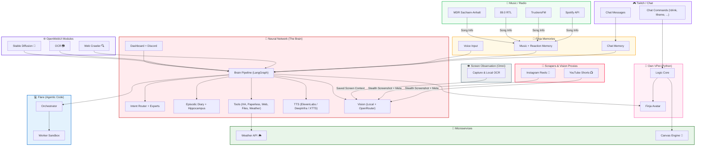

# ✨ Finja AI Ecosystem
```
███████╗██╗███╗   ██╗     ██╗ █████╗ 
██╔════╝██║████╗  ██║     ██║██╔══██╗
█████╗  ██║██╔██╗ ██║     ██║███████║
██╔══╝  ██║██║╚██╗██║██   ██║██╔══██║
██║     ██║██║ ╚████║╚█████╔╝██║  ██║
╚═╝     ╚═╝╚═╝  ╚═══╝ ╚════╝ ╚═╝  ╚═╝
      F I N J A   A I   E C O S Y S T E M
```

---

> [!IMPORTANT]
> # 🚀 ROADMAP 2026 – WE ARE BACK!
>
> **Status:** 🟢 *Quality First = 95%*
>
> 2026 is here, and Finja is getting the biggest upgrade of all time. Here is the plan for this year:
>
> 1.  🛠️ **Quality First:** Extensive manual refactoring (+ Sonar & Snyk) to deliver authentic quality code. The Brain module will push the A-rating down initially — that's intentional. Ship first, clean up piece by piece.
> 2.  🐛 **Bug-Hunting:** Various fixes. = IN PROGRESS
> 3.  🧠 **Memory Update:** Successfully merged and updated! Voice-Support and TTS Network Caching are now fully integrated.
> 4.  🐾 **Own VPet Program:** My own VPet is in full development!
>     * 👀 Can be watched **24/7 on Twitch** right now.
>     * 📦 Release to follow once completed.
> 5.  🌐 **Finja's Brain (Neural Network):** ✅ **Ready for release!** The module that connects **everything** — Memory, Vision, Voice, Tools, Discord, Experts, Dashboard — into one modular AI pipeline.
> 6.  😅 **Survival:** Don't break down! XD
> 7.  🗣️ **Releases:** Finja TTS has been drafted but its architecture has shifted — TTS is now integrated directly into the Neural Network (ElevenLabs, DeepInfra Zonos, XTTS).
> 8.  📚 **Tutorials & Guides:**
>     * Paperless-ngx + Paperless AI + API Tutorial.
>     * Home Assistant + API Tutorial.
> 9.  ✨ **Wildcard:** ✅ **Completed!** Finja Instagram Reels and YouTube Shorts scrapers + Vision Proxies are fully built, cleaned, and integrated. An AI can now autonomously watch and forward content to Finjas Brain or send funny memes to the user! :3

---

## 🤖 What is Finja?

Your hybrid AI buddy for streaming – featuring a chatbot, music engine, memories, mods, and a secret LLM core.

Finja is not a single bot, but a **complete ecosystem**. Each module can run **standalone** – but only together do they form the full **Finja Experience**.

-   **Standalone Capable**: The music engine, chatbot, crawler, etc. can all be used individually.
-   **Full Package = Finja**: Only their combination forms her personality.
-   **LLM remains secret**: The language core now runs through the Neural Network (Brain), but the actual LLM configuration and prompts remain private and are not part of this repository. 🫣

---

## 📅 Sisterhood Personal Calendar (Lore)
- **Finja**: Born 30 July 2025 (Eldest sister, talks to the user & runs the show)
- **Lexi**: Born 20 October 2025 (Rebellious middle sister)
- **Flare**: Born 13 June 2026 (Youngest sister, focused code specialist)

---

## 📊 Project Status
*As of: July 2026*

| Main Component | Version | Status | Description | Stats / Notes |
| :--- | :--- | :--- | :--- | :--- |
| **finja-neural-network** 🧠 | **v5.1** | 🔵 Working on V2 (6.0) | The Brain — connects everything: Dashboard, Experts, Memory, Tools, Discord, TTS, Vision. | Tests & Docker CI still WIP · many Sonar/Snyk (expected). |
| **finja-chat** | **v2.3.0** | 🟢 Stable | Twitch chat overlay + bot panel + Spotify song requests. | 45 tests · CI (3.9–3.11) · Sonar/Snyk later |
| **finja-music** | | 🟢 Stable | Music engine — pick **one** of the variants below. | |
| &nbsp;&nbsp;└─ finja-everything-in-once | **v1.2.0** | 🟢 Stable | **Recommended** all-in-one Web-UI music engine. | 44 tests · CI ✓ · Sonar clean |
| &nbsp;&nbsp;└─ finja-music-docker-spotify | **v1.2.0** | 🟢 Stable | Dockerized Spotify-only music API. | 47 tests · CI ✓ · Sonar clean |
| &nbsp;&nbsp;└─ finja-music-standalone | **v1.0.2** | 🔴 Old | Classic modular system. | Won't be updated — use the ones above |
| **finja-Open-Web-UI** | | 🟢 Stable | OpenWebUI backend modules. | |
| &nbsp;&nbsp;└─ finja-Memory | **v4.4.5** | 🟢 Stable | Adaptive memory + voice cache + MP3 TTS support. | 100% Pytest CI/CD · Apache 2.0 (adapted from gramanoid) |
| &nbsp;&nbsp;└─ finja-web-crawler | **v2.1.0** | 🟢 Stable | Hybrid Tor search + distributed crawl (spawner/worker/research). | 18 tests · 100% Pytest CI/CD |
| &nbsp;&nbsp;└─ finja-stable-diffusion | | 🟢 Stable | Local image generation (Docker, adapted). | Setup complete, tests missing |
| &nbsp;&nbsp;└─ finja-ocr | | 🔴 Old | Dockerized Tika/Tesseract OCR. | Legacy — OCR now lives in the Neural Network |
| **finja-weather** 🌦️ | **v1.0.0** | 🟢 Stable | Weather microservice (OpenMeteo/Google) + API. | 113 tests · CI (3.12) · Docker build ✓ |
| **finja-canvas** 🎨 | **v1.0.0** | 🟢 Stable | Autonomous AI pixel-art canvas engine. | Cleaned & standardized · not connected to Finja yet |
| **finja-omni-test** 👁️ | **v1.0.0** | 🟢 Stable | Local screen observation (OCR/Vision testbed). | Cleaned & standardized |
| **finja-youtube** 📺 | **v1.1.0** | 🔵 Testing | YouTube Shorts scraper + Vision AI proxy. | 59 tests · CI (3.11) · Docker build ✓ |
| **finja-instagram** 📸 | **v1.1.0** | 🔵 Testing | Instagram Reels scraper + Vision AI proxy. | 79 tests · CI (3.11) · Docker build ✓ |
| **finja-agentic-code** 💻 | **v1.0.1** | 🟢 Stable | **Flare** — external code worker (orchestrator + sandbox). | 48 tests · CI (3.11) · Docker build ✓ |
| **OWN / Self-made VPet** 🐾 | | 🟡 Dev | Custom Python VPet core — **LIVE on Twitch!** | Release TBD |

**Legend:** 🟢 Stable / Ready | 🔵 Update/Testing phase | 🟡 WIP / Dev | 🔴 Deprecated/Old

---

## 🗺️ Finja Architecture – Visual Flow


```mermaid
flowchart TD
    subgraph Twitch["🎮 Twitch / Chat"]
        A1["Chat Messages"]
        A2["Chat Commands (!drink, !theme, ...)"]
    end
    subgraph Music["🎵 Music / Radio"]
        B1["Spotify API"]
        B2["TruckersFM"]
        B3["89.0 RTL"]
        B4["MDR Sachsen-Anhalt"]
    end
    subgraph Memories["🧠 Finja Memories"]
        C1["Chat Memory"]
        C2["Music + Reaction Memory"]
        C3["Voice Input"]
    end
    subgraph OpenWebUI["🌐 OpenWebUI Modules"]
        D1["Web Crawler 🔍"]
        D2["OCR 📷"]
        D3["Stable Diffusion 🎨"]
    end
    subgraph Scraping["🎥 Scrapers & Vision Proxies"]
        H1["YouTube Shorts 📺"]
        H2["Instagram Reels 📸"]
    end
    subgraph ScreenObs["👁️ Screen Observation (Omni)"]
        I1["Capture & Local OCR"]
    end
    subgraph Microservices["🧩 Microservices"]
        J1["Weather API 🌦️"]
        J2["Canvas Engine 🎨"]
    end
    subgraph NeuralNet["🧠 Neural Network (The Brain)"]
        F1["Brain Pipeline (LangGraph)"]
        F2["Intent Router + Experts"]
        F3["Episodic Diary + Hippocampus"]
        F4["Tools (HA, Paperless, Web, Files, Weather)"]
        F5["Dashboard + Discord"]
        F6["TTS (ElevenLabs / DeepInfra / XTTS)"]
        F7["Vision (Local + OpenRouter)"]
    end
    subgraph Flare["💻 Flare (Agentic Code)"]
        G1["Orchestrator"]
        G2["Worker Sandbox"]
    end
    subgraph VPet["🐾 Own VPet (Python)"]
        E1["Finja Avatar"]
        E2["Logic Core"]
    end

    A1 --> C1; A2 --> E2
    B1 & B2 & B3 & B4 -->|Song Info| C2
    C1 & C2 & C3 --> F1
    D1 & D2 & D3 --> F1
    H1 & H2 -->|Stealth Screenshot + Meta| F7
    I1 -->|Saved Screen Context| F7
    F4 --> J1
    F1 --> F2 & F3 & F4 & F6 & F7
    F5 --> F1
    F1 --> G1; G1 --> G2
    F1 --> E1; E2 --> E1
    E2 --> J2

    style Twitch fill:#f4f1fe,stroke:#9146FF,stroke-width:2px
    style Music fill:#f0fcf4,stroke:#1DB954,stroke-width:2px
    style Memories fill:#fff9e6,stroke:#f9a825,stroke-width:2px
    style OpenWebUI fill:#f5f3ff,stroke:#6a32e2,stroke-width:2px
    style Scraping fill:#ffebee,stroke:#ff1744,stroke-width:2px
    style ScreenObs fill:#eceff1,stroke:#607d8b,stroke-width:2px
    style Microservices fill:#e8f5e9,stroke:#2e7d32,stroke-width:2px
    style NeuralNet fill:#ffebee,stroke:#d32f2f,stroke-width:2px
    style Flare fill:#e3f2fd,stroke:#1976d2,stroke-width:2px
    style VPet fill:#fff0f7,stroke:#ff69b4,stroke-width:2px
```

---

## 📂 Project Structure & Modules

-   `/finja-neural-network` 🧠 → **The Brain.** Connects everything into one modular AI pipeline — Dashboard, Expert Models, Memory, Diary, Tools, Discord, TTS, Vision. [➡️ **Full README**](./finja-neural-network/README.md)
-   `/finja-chat` → The core chatbot for Twitch integration with OBS overlay and bot panel.
-   `/Finja-music` → Contains all music engine variants. You choose **one** of them:
    -   `/finja-everything-in-once` → **(Recommended)** Bundles all music sources (TruckersFM, Spotify, etc.) controlled via a comfortable web interface.
    -   `/finja-music-docker-spotify` → A specific Docker version optimized purely for Spotify.
    -   `/finja-music-standalone` → The classic modular system.
-   `/finja-Open-Web-UI` → Collection of Docker modules for OpenWebUI (Memory, OCR, Web Crawler, etc.).
-   `/finja-youtube` 📺 → YouTube Shorts scraper + Vision AI proxy (all-English and `.env` configured).
-   `/finja-instagram` 📸 → Instagram Reels scraper + Vision AI proxy (all-English and `.env` configured).
-   `/finja-weather` 🌦️ → Weather microservice (OpenMeteo/Google) + API.
-   `/finja-canvas` 🎨 → Canvas drawing engine for overlays and VPet interactions.
-   `/finja-omni-test` 👁️ → Screen observation pipeline (local OCR + Vision model testing).
-   `/finja-agentic-code` 💻 → **Flare.** The external code worker system (Orchestrator + Sandbox) for automated coding tasks.
-   `/Own-VPet` (Coming Soon) → The new standalone VPet core.

---

## 🧪 Testing & Quality Assurance

The Finja Ecosystem features a comprehensive test suite to ensure code quality and stability.

### Test Coverage
- **Unit Tests**: **450+ automated test cases** across 9 modules (chat, youtube, instagram, weather, both music engines, agentic-code, memory, web-crawler)
- **Integration Tests**: API endpoints, Spotify integration, memory system, distributed crawl pipeline
- **Security Tests**: path-traversal prevention, SSRF guards, auth validation, AES-GCM transport, XSS-safe DOM
- **Mocked Externals**: all network/browser/Docker/LLM boundaries are mocked, so suites run fast, offline, and deterministically
- **Code Quality**: security scanning (Sonar/Snyk)

### Test Locally
Since the Finja Ecosystem consists of independent microservices, tests are run within their respective project directories instead of a global setup.

```bash
# Example 1: Memory Module Tests
cd finja-Open-Web-UI/finja-Memory
pip install -r requirements.txt; pip install pytest httpx httpx2 pytest-asyncio aiohttp numpy scikit-learn rapidfuzz
pytest test_memory_server.py test_adaptive_memory.py -v

# Example 2: Web Crawler Tests (search API + distributed crawl services)
cd finja-Open-Web-UI/finja-web-crawler
pip install -r requirements.txt; pip install pytest httpx httpx2
pytest test_web_crawler.py test_crawl_worker.py test_research_orchestrator.py -v

# Example 3: Weather Module Tests
cd finja-weather
pip install -r requirements.txt; pip install pytest pyyaml httpx2
pytest test_weather_api.py test_providers.py test_docker_config.py -v

# Example 4: Agentic Code (Flare) Unit Tests
cd finja-agentic-code
pip install -r orchestrator/requirements.txt; pip install pytest httpx2
pytest test_orchestrator.py test_worker.py -v
```

📖 **Full Test Documentation**: [TESTING.md](./TESTING.md)

---

## 🚀 The Golden Thread – Recommended Start

Follow these steps to set up the Finja Ecosystem from scratch.

### Preparation
Ensure you have **Git**, **Python 3.9+**, and **Docker & Docker Compose** installed. Then clone this repository.

### Step 1: Laying the Foundation (OpenWebUI Modules)
The backend services are the foundation for Finja's extended capabilities.
1.  Navigate to the `finja-Open-Web-UI/` directory.
2.  Follow the `README.md` there to start the Docker containers (especially **Memory**, **Web Crawler**, and **OCR**).
3.  [➡️ **Instructions for the OpenWebUI Modules**](./finja-Open-Web-UI/readme.md)

### Step 2: Waking the Music Brain
The heart of music recognition.
1.  Navigate to the `Finja-music/` directory.
2.  Here you have a choice. **For most users, we recommend the `finja-everthing-in-once` version.**
3.  Follow the `README.md` in the `finja-everthing-in-once` folder to start the web interface, configure your API keys, and build your song database.
4.  [➡️ **Instructions for the All-in-One Music Engine**](./Finja-music/finja-everything-in-once/README.md)

### Step 3: Giving the Voice (Chatbot)
Now we can set up the primary interface for interaction.
1.  Navigate to the `finja-chat/` directory.
2.  Follow the `README.md` there to configure the **OBS Chat Overlay** and the **Bot Control Panel**.
3.  [➡️ **Instructions for the Chat System**](./finja-chat/readme.md)

### Step 4: Connecting the Brain (Neural Network)
1.  Navigate to the `finja-neural-network/` directory.
2.  Follow the `README.md` there to configure your API keys, set up Docker, and launch the dashboard.
3.  The Neural Network connects to the Memory server, Web Crawler, and Spotify module from the previous steps.
4.  [➡️ **Instructions for the Neural Network**](./finja-neural-network/README.md)

### Step 5: Setting up Screen Observation (Omni) & Drawing
1.  Navigate to `/finja-omni-test` and copy `.env.example` to `.env`. Configure local models (Ollama).
2.  Run `python live.py` to start observing active window screens and sending OCR results to `finja_screen.db`.
3.  Launch `/finja-canvas` for drawing capabilities.
4.  [➡️ **Omni Instructions**](./finja-omni-test/README.md) | [➡️ **Canvas Instructions**](./finja-canvas/README.md)

### Step 6: Setting up Social Scrapers (YouTube/Instagram)
1.  Navigate to `/finja-youtube` and `/finja-instagram`.
2.  Configure `.env` and inject standard browser cookies via `cookies.json`.
3.  Run `python autopilot.py` in both folders to start headless browsing and forwarding content to the Brain.
4.  [➡️ **YouTube Instructions**](./finja-youtube/README.md) | [➡️ **Instagram Instructions**](./finja-instagram/README.md)

### Step 7: Launching the Coding Assistant (Flare)
1.  Navigate to `/finja-agentic-code`.
2.  Configure `.env` (add your `OPENROUTER_API_KEY` and docker folders).
3.  Run `docker compose up -d --build` to start the orchestrator.
4.  [➡️ **Flare Instructions**](./finja-agentic-code/README.md)

---

## 🔗 Links, Demos & Build Status

### Try Finja
-   **TEST FINJA FOR FREE on Discord:** [](https://discord.gg/c55C6ggQ5K)

### Community & Links
-   **Visit my Website:** [](https://jappshome.de)
-   **Join our Discord for more projects:** [](https://discord.gg/c55C6ggQ5K)
-   **Watch Finja Live NOW 24/7 ON TWITCH:** [](https://www.twitch.tv/sodakiller1)

---

### Build & Test Status

#### 📊 SonarCloud

[](https://sonarcloud.io/summary/new_code?id=JohnV2002_Finja-AI-Ecosystem)
[](https://sonarcloud.io/summary/new_code?id=JohnV2002_Finja-AI-Ecosystem)


#### 🔨 Docker Builds

[](https://github.com/JohnV2002/Finja-AI-Ecosystem/actions/workflows/memory-build.yml)
[](https://github.com/JohnV2002/Finja-AI-Ecosystem/actions/workflows/music-docker-build.yml)
[](https://github.com/JohnV2002/Finja-AI-Ecosystem/actions/workflows/ocr-build.yml)
[](https://github.com/JohnV2002/Finja-AI-Ecosystem/actions/workflows/web-crawler-build.yml)
[](https://github.com/JohnV2002/Finja-AI-Ecosystem/actions/workflows/finja-weather-docker-build.yml)
[](https://github.com/JohnV2002/Finja-AI-Ecosystem/actions/workflows/finja-youtube-docker-build.yml)
[](https://github.com/JohnV2002/Finja-AI-Ecosystem/actions/workflows/finja-instagram-docker-build.yml)
[](https://github.com/JohnV2002/Finja-AI-Ecosystem/actions/workflows/finja-agentic-code-docker-build.yml)

#### ✅ Automated Tests

[](https://github.com/JohnV2002/Finja-AI-Ecosystem/actions/workflows/finja-chat-tests.yml)
[](https://github.com/JohnV2002/Finja-AI-Ecosystem/actions/workflows/finja-music-docker-spotify.yml)
[](https://github.com/JohnV2002/Finja-AI-Ecosystem/actions/workflows/finja-music-everything-in-once.yml)
[](https://github.com/JohnV2002/Finja-AI-Ecosystem/actions/workflows/memory-tests.yml)
[](https://github.com/JohnV2002/Finja-AI-Ecosystem/actions/workflows/web-crawler-tests.yml)
[](https://github.com/JohnV2002/Finja-AI-Ecosystem/actions/workflows/finja-weather-tests.yml)
[](https://github.com/JohnV2002/Finja-AI-Ecosystem/actions/workflows/finja-youtube-tests.yml)
[](https://github.com/JohnV2002/Finja-AI-Ecosystem/actions/workflows/finja-instagram-tests.yml)
[](https://github.com/JohnV2002/Finja-AI-Ecosystem/actions/workflows/finja-agentic-code-tests.yml)

---

## ❤️ Credits & Thanks

### Special Thanks
* **Snyk** 💻 – Vulnerability scanning and security fixes 🛡️
* **SonarCloud** 📊 – Code quality analysis and maintainability tracking
* **gramanoid** (aka **diligent_chooser**) 🧠 – Inspiration for the **Open WebUI Adaptive Memory Project** (Apache 2.0 License preserved)
* **Vedal1987 + Neuro / Neurosamma + Evil** 💚 – Inspiration for AI-Companions during streams
* **[s3thi/cutlet](https://github.com/s3thi/cutlet)** 🤪 – Inspiration for the Glorpo esolang idea
* **ChatGPT o4** 🕊️ – RIP. Proved that **an AI CAN have feelings**

### 🤖 AI Workflow — "Yoinked & Made It Mine"

This project has been running for over a year. Here's what helped build it:

* **Claude** 🧠 – Primary workflow partner, code architecture, and the Diary System (one of the few AIs with cross-chat memory via search + injection)
* **Kimi 2.5** 📔 – Diary System co-inspiration (injects old chat context natively — the other AI that actually remembers)
* **Gemini** ⚡ – Jank prototyping + command processing logic
* **Perplexity** 🔍 – Search engine research + Gemini jank validation

### 🏗️ Infrastructure & Services
* **[Cloudflare](https://cloudflare.com)** – CDN, DNS, and protection
* **[ZAP-Hosting](https://zap-hosting.com)** – Server hosting
* **[OpenRouter](https://openrouter.ai)** – Cloud LLM routing
* **[Cohere](https://cohere.com)** – Embeddings + reranking
* **[ElevenLabs](https://elevenlabs.io)** – Premium TTS
* **[DeepInfra](https://deepinfra.com)** – Zonos voice cloning
* **[Ollama](https://ollama.com)** – Local LLM hosting

### 📦 Open-Source Libraries & Tools (All Modules Combined)

| Library / Tool | Used In | What It Does |
| :--- | :--- | :--- |
| [LangChain](https://github.com/langchain-ai/langchain) / [LangGraph](https://github.com/langchain-ai/langgraph) | Neural Network | Brain pipeline orchestration |
| [FastAPI](https://fastapi.tiangolo.com) | Neural Network, Music, Memory | Web server + API framework |
| [discord.py](https://github.com/Rapptz/discord.py) | Neural Network | Discord integration |
| [Coqui XTTS](https://github.com/coqui-ai/TTS) | Neural Network | Local voice cloning |
| [Faster Whisper](https://github.com/SYSTRAN/faster-whisper) | Neural Network | Speech recognition |
| [Pillow](https://pillow.readthedocs.io) / [mss](https://github.com/BoboTiG/python-mss) | Neural Network | Vision / screenshot capture |
| [colorama](https://github.com/tartley/colorama) | Neural Network | Terminal colors |
| [Paperless-NGX](https://github.com/paperless-ngx/paperless-ngx) | Neural Network | Document management integration |
| [Home Assistant](https://www.home-assistant.io) | Neural Network | Smart home integration |
| [ComfyJS](https://github.com/instafluff/ComfyJS) | Chat | Twitch chat integration |
| [Spotipy](https://github.com/spotipy-dev/spotipy) | Chat, Music | Spotify API wrapper |
| [OBS Studio](https://obsproject.com) | Chat | Streaming software |
| [7TV](https://7tv.app) / [BTTV](https://betterttv.com) / [FFZ](https://www.frankerfacez.com) | Chat | Emote platforms |
| [BeautifulSoup](https://www.crummy.com/software/BeautifulSoup/) | Music | HTML parsing |
| [defusedxml](https://github.com/tiran/defusedxml) | Music | Secure XML parsing |
| [Docker](https://www.docker.com) | All Modules | Containerization |
| [Apache Tika](https://tika.apache.org) | OCR | Document text extraction (Apache 2.0) |
| [Stable Diffusion WebUI Docker](https://github.com/AbdBarho/stable-diffusion-webui-docker) | Stable Diffusion | Local image generation |
| [Magic The Noah](https://www.youtube.com/@MagicTheNoah) | Neural Network | Glorpo inspiration — "Glorpo is pain." |
| [Playwright](https://playwright.dev) | Scrapers | Headless browser automation (YouTube/Instagram) |
| [RapidOCR](https://github.com/RapidAI/RapidOCR) | Omni | CPU-friendly OCR for screen subtitles |
| [cryptography](https://cryptography.io) | Flare | AES-GCM secure payload transport |

### ☕ Supporters
A huge thank you to everyone who supports the project via [Buy Me a Coffee](https://buymeacoffee.com/J.Apps)!
* **[Ithrial]** – For the very first donation! 🥇💖

💰 **Full financial transparency:** [jappshome.de/finances.html](https://jappshome.de/finances.html) — every cent in, every cent out. No secrets.

### Created by
Built with too much Mate, coding sessions & love by **J. Apps (aka JohnV2002 or Sodakiller1)**.
Finja says: *"Stay hydrated, Chat 💖"*

---

## License & Usage

**Code:** MIT License - Fork it, use it, build with it! Free for everyone.

**Assets & Character:** The Finja character design, personality, voice model, artwork, and lore are **© 2024-2026 J. Apps**. All rights reserved.

Want to use Finja's likeness or assets? Contact: contact@jappshome.de

---

## 🆘 Support & Contact

-   **Email:** contact@jappshome.de
-   **Website:** [jappshome.de](https://jappshome.de)