---

📄 **README.md**

---

```markdown
███████╗██╗███╗   ██╗     ██╗ █████╗ 
██╔════╝██║████╗  ██║     ██║██╔══██╗
█████╗  ██║██╔██╗ ██║     ██║███████║
██╔══╝  ██║██║╚██╗██║██   ██║██╔══██║
██║     ██║██║ ╚████║╚█████╔╝██║  ██║
╚═╝     ╚═╝╚═╝  ╚═══╝ ╚════╝ ╚═╝  ╚═╝
      F I N J A   A I   E C O S Y S T E M
```

---

## Build Status

[](https://github.com/JohnV2002/Finja-AI-Ecosystem/actions/workflows/memory-build.yml)
[](https://github.com/JohnV2002/Finja-AI-Ecosystem/actions/workflows/ocr-build.yml)
[](https://github.com/JohnV2002/Finja-AI-Ecosystem/actions/workflows/web-crawler-build.yml)

---

## Links / Badges

* **Schau dir Finja live an jeden Samstag auf Twitch**   [](https://www.twitch.tv/sodakiller1)
* **Schau auf Discord vorbei für Mehr Projekte**   [](https://discord.com/invite/c55C6ggQ5K)
* **Schau gerne auf Meiner Website vorbei**   [](https://jappshome.de)
* **TESTE FINJA KOSTENLOS (OHNE MEMORY):**   [](https://jappshome.de/livetest.html)
* **TESTE FINJA WÄREND SIE OFFLINE IST (MIT MEMORY):**   [](https://openwebui.jappshome.de)

---

# ✨ Finja AI Ecosystem

Dein Hybrid-KI-Buddy fürs Streaming – mit Chatbot, Musikengine, Memories, Mods und einem geheimen LLM-Core.

---

## 🤖 What’s Finja?

Finja ist kein einzelner Bot, sondern ein **komplettes Ökosystem**.
Jedes Modul kann **standalone** laufen – aber nur zusammen ergibt’s die volle **Finja-Experience**.

* **Standalone möglich**: Musikengine, Chatbot, Crawler usw. einzeln nutzbar
* **Full Package = Finja**: erst die Kombi formt ihre Persönlichkeit
* **LLM bleibt geheim**: läuft nur im VPet-Simulator, nicht veröffentlicht 🫣

---

## 📊 Projektstatus-Übersicht

*Stand: 17.09.2025*

| Hauptkomponente             | Status     | Bemerkungen |
|-----------------------------|------------|-------------|
| **assets**                  |  Stabil   | Keine bekannten Probleme |
| **finja-chat**              |  Stabil   | Added LLM Support, Made it more Modular |
| **finja-music**             |  Stabil   | Snyk false Positive |
|   â””─ 89.0RTL      |  Stabil   | Snyk false Positive |
|   â””─ MDR          |  Stabil   | Keine Probleme |
|   â””─ Spotify      |  Stabil   | Snyk false Positive |
|   â””─ TruckersFM   |  Stabil   | Snyk false Positive |
| **finja-Open-Web-UI**       |  Stabil   | Snyk false Positive |
|   â””─ finja-Memory |  Stabil   | snyk false Positive |
|   â””─ finja-ocr    |  Stabil   | Funktioniert einwandfrei |
|   â””─ finja-stable-diffusion |  Stabil | Setup abgeschlossen, keine Tests |
|   â””─ finja-tts    | ⚠ WIP      | Noch nicht implementiert |
|   â””─ finja-web-crawler |  Stabil | Kein Rate-Limit! Security-Review OK |
| **VPet-Simulator Mods**     | ⚠ WIP      | Aktuell geplant, noch leer |
|   â””─ Chat Commands | ⚠ WIP      | In Planung |
|   â””─ Dance zu Liked Music | ⚠ WIP | In Planung |

**Im BACK! Working on Stuff.**

---

## 🧩 Projektübersicht

### 💬 1. Chatbot

* Integration in Twitch-Chat
* Commands werden **ausgeführt** (`!drink`, `!theme`, `!help`)
* Feedback im Chat: “✅ Done” oder “❌ Nope” + kleine Reaction
* Langzeitgedächtnis für User + Stream

---

### 🎵 2. Musik + Radio (mit Memory)

* Song/Genre-Erkennung (Spotify, TruckersFM, 89.0 RTL, MDR …)
* Merkt sich Reaktionen zu Songs/Genres
* 600+ dynamische Reaktionen (von wholesome bis meme)
* Kontextabhängig: Minecraft = Chill und lofi, ETS2 = Pop, Rock, vieles Mehr 

---

### 🌐 3. OpenWebUI-Module

* **3.1 Chat-Memory** – Langzeitgedächtnis für Streams, User & Facts
* **3.2 Web Crawler** – Infosuche via TOR mit Google-Fallback
* **3.3 OCR** – Text aus Bildern lesen
* **3.4 Stable Diffusion** – Bilder generieren
* **3.5 TTS (planned)** – Stimme für Finja

---

### 🔒 4. Finja LLM (privat)

* Läuft **nur im VPet-Simulator** als Mod
* Bindet via OpenWebUI an Module an
* Bleibt **geschlossen / nicht veröffentlicht**

---

### 🐾 5. VPet-Simulator Integration

* **5.1 Chat-Commands als echte Aktionen** (`!drink` → Finja kriegt was zu trinken)
* **5.2 Mehr Mods** für zusätzliche Interaktionen

---

## 🚀 Architektur – Föderiert & Hybrid

* **Rule-Engines** → stabil & schnell
* **Module** → separat oder kombiniert nutzbar
* **LLM (privat)** → nur fürs VPet, nicht Teil des Repos

---

## 🗺️ Finja Architektur – Visueller Flow

```mermaid
flowchart TD
    subgraph Twitch["🎮 Twitch / Chat"]
        A1["Chat Messages"]
        A2["Chat Commands (!drink, !theme, ...)"]
    end
    subgraph Music["🎵 Music / Radio"]
        B1["Spotify API"]
        B2["TruckersFM"]
        B3["89.0 RTL"]
        B4["MDR Sachsen-Anhalt"]
    end
    subgraph Memories["🧠 Finja Memories"]
        C1["Chat Memory"]
        C2["Music + Reaction Memory"]
    end
    subgraph OpenWebUI["🌐 OpenWebUI Modules"]
        D1["Web Crawler 🔍"]
        D2["OCR 📷"]
        D3["Stable Diffusion 🎨"]
        D4["TTS 🔊 (planned)"]
    end
    subgraph VPet["🐾 VPet Simulator"]
        E1["Finja Avatar"]
        E2["Mods (z.B. !drink = Animation)"]
    end
    subgraph LLM["🔒 Finja LLM (privat)"]
        F1["Language Core"]
    end

    A1 --> C1; A2 --> E2
    B1 & B2 & B3 & B4 -->|Song Info| C2
    C1 & C2 & D1 & D2 & D3 & D4 --> F1
    F1 --> E1; E2 --> E1

    style Twitch fill:#f4f1fe,stroke:#9146FF,stroke-width:2px
    style Music fill:#f0fcf4,stroke:#1DB954,stroke-width:2px
    style Memories fill:#fff9e6,stroke:#f9a825,stroke-width:2px
    style OpenWebUI fill:#f5f3ff,stroke:#6a32e2,stroke-width:2px
    style VPet fill:#fff0f7,stroke:#ff69b4,stroke-width:2px
    style LLM fill:#ffebee,stroke:#d32f2f,stroke-width:2px
```



---

## 📂 Repo-Struktur

Die Hauptkomponenten des Finja-Ökosystems sind wie folgt organisiert:

* `/finja-chat` → Der Kern-Chatbot für die Twitch-Integration.
* `/Finja-music` → Hauptmodul für die Musik- und Radioerkennung, unterteilt nach Quellen:
    * `/89.0RTL`
    * `/MDR`
    * `/Spotify`
    * `/TruckersFM`
* `/finja-Open-Web-UI` → Sammlung von Modulen, die mit OpenWebUI interagieren:
    * `/finja-Memory` → Das Langzeitgedächtnis für Chats und Musik.
    * `/finja-ocr` → Modul zur Texterkennung aus Bildern.
    * `/finja-stable-diffsion` → Modul zur Bildgenerierung (Stable Diffusion).
    * `/finja-tts` → Geplantes Modul für die Sprachausgabe (Text-to-Speech).
    * `/finja-web-crawler` → Modul für die Websuche via TOR/DDG/Google.
* `/VPet-Simulator Mods` → Spezifische Mods für den VPet-Simulator-Avatar:
    * `/Chat Commands` → Implementierung der Chat-Befehle als Aktionen im Spiel (Geplant).
    * `/Dance zu Liked Music` → Lässt den Avatar auf als "gemocht" erkannte Musik reagieren (Geplant).

---

## 🚀 Der rote Faden – Empfohlener Start

Folge diesen Schritten, um das Finja-Ökosystem von Grund auf einzurichten.

### Vorbereitung
Stelle sicher, dass du die folgenden Werkzeuge installiert hast:
-   **Git**
-   **Python 3.9+**
-   **Docker & Docker Compose**

Klone zuerst dieses Repository auf deinen Computer:
```bash
git clone https://github.com/DeinUsername/finja-ai-ecosystem.git
cd finja-ai-ecosystem
```

### Schritt 1: Das Fundament legen (OpenWebUI-Module)
Die Backend-Dienste sind die Grundlage für Finjas erweiterte Fähigkeiten wie Gedächtnis und Websuche.
1.  Navigiere in das Verzeichnis `finja-Open-Web-UI/`.
2.  Folge der dortigen `README.md`, um die Docker-Container für die gewünschten Dienste (besonders **Cloud Memory**, **Web Crawler** und **OCR**) zu starten.
3.  Konfiguriere die Dienste in deiner OpenWebUI-Instanz.

[➡️ **Zur Anleitung für die OpenWebUI-Module**](./finja-Open-Web-UI/README.md)

### Schritt 2: Das Musik-Gehirn erschaffen
Das Herzstück der Musikerkennung ist eine zentrale Wissensdatenbank (`songs_kb.json`).
1.  Navigiere in das Verzeichnis `Finja-music/`.
2.  Folge der dortigen `README.md`, um das **TruckersFM-Modul** einzurichten. Dessen `MUSIK`-Ordner dient als unser zentrales Gehirn.
3.  Nutze die **Spotify-Tools** in `Finja-music/TruckersFM/MUSIK/`, um aus deinen Playlist-Exporten eine umfassende `songs_kb.json` zu erstellen.

[➡️ **Zur Anleitung für das Musik-System**](./Finja-music/README.md)

### Schritt 3: Die Stimme geben (Chatbot)
Jetzt, wo das Backend bereit ist, können wir die primäre Schnittstelle für die Interaktion einrichten.
1.  Navigiere in das Verzeichnis `finja-chat/`.
2.  Folge der dortigen `README.md`, um den **OBS Chat-Overlay**, das **Bot Control Panel** und das **Song Request System** zu konfigurieren.
3.  Hierfür benötigst du einen Twitch OAuth Token und ggf. Spotify API Keys.

[➡️ **Zur Anleitung für das Chat-System**](./finja-chat/README.md)

### Schritt 4: Die visuelle Form (VPet-Simulator)
Der letzte Schritt ist, Finja im VPet-Simulator zum Leben zu erwecken.
1.  Navigiere in das Verzeichnis `VPet-Simulator Mods/`.
2.  Folge der dortigen `README.md`, um die geplanten Mods zu verstehen, die Chat-Befehle (`!drink`) und Musik-Reaktionen in sichtbare Animationen umwandeln.
3.  **Hinweis:** Dieses Modul ist noch stark in der Entwicklung (Work in Progress).

[➡️ **Zur Anleitung für die VPet-Mods**](./VPet-Simulator%20Mods/readme.md)

---

## 📜 License

MIT-License.
Alle Module sind Open-Source – das **LLM bleibt privat**.

---

## ❤️ THANKS

Ein riesiges Dankeschön an **Synk** 💻  
für die Hilfe beim Finden und Fixen von Vulnerabilities –  
und dafür, dass dieses Projekt **sicher & geschützt** bleibt 🛡️

---

Ein **dickes Dankeschön** an **gramanoid** (aka **diligent_chooser**) 🧠  
Er war meine Inspiration für das **Open WebUI Adaptive Memory Projekt**!  
Ohne ihn gäb’s Finjas Memory-System so nicht 💖

- [👤 Reddit-Profil](https://www.reddit.com/user/diligent_chooser/?utm_source=share&utm_medium=web3x&utm_name=web3xcss&utm_term=1&utm_content=share_button)
- [📄 Original Reddit-Post](https://www.reddit.com/r/OpenWebUI/comments/1kd0s49/adaptive_memory_v30_openwebui_plugin/)
- [🧩 Open WebUI Plugin-Seite](https://openwebui.com/f/alexgrama7/adaptive_memory_v2)

**Danke auch für die Freigabe unter Apache 2.0-Lizenz Habe Diese beibehalten! (NUR FÜR CHAT - MEMORY!) 💖**


---

Und natürlich auch Shoutout an  
**Vedal1987 + Neuro / Neurosamma + Evil** 💚  
für die ursprüngliche Idee, **AI-Companions beim Streamen** zu nutzen —  
ihr wart die Inspiration, das überhaupt zu versuchen 🫶

- [🎥 Twitch](https://www.twitch.tv/vedal987)
- [🌐 Vedal.ai (alle weiteren Links dort)](https://vedal.ai/)

---

## ❤️ Credits

Built mit zu viel Mate, Coding-Sessions & Liebe by **J. Apps**.
Finja sagt: *“Stay hydrated, Chat 💖”*

---

## 🆘 Support & Kontakt

-   **E-Mail:** contact@jappshome.de
-   **Website:** [jappshome.de](https://jappshome.de)
-   **Unterstützung:** [Buy Me a Coffee](https://buymeacoffee.com/J.Apps)
