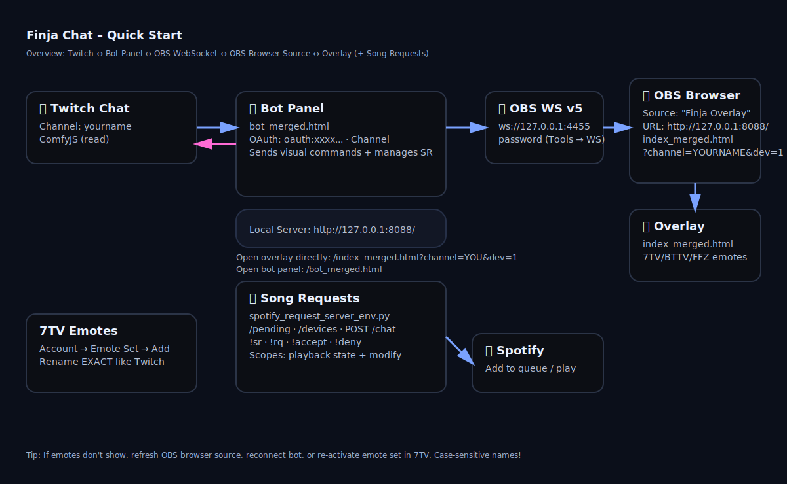

# 💬 Finja Chat System
 *OBS Chat-Overlay + Bot-Panel + Song-Requests – cute, fast, Gen‑Z approved.*

> **Kurzfassung**:  
> - Starte `start_static_server.bat` → öffne `http://127.0.0.1:8088/`  
> - Overlay (DEV): `http://127.0.0.1:8088/index_merged.html?channel=DEINCHANNEL&dev=1`  
> - Bot-Panel: `http://127.0.0.1:8088/bot_merged.html` → Twitch **OAuth** eintragen → **Verbinden**  
> - (Optional) Song-Requests: `spotify_request_server_env.py` starten → `!sr` im Chat benutzen

---

## ⚡ Quick Start



> Leg die `quickstart.svg` einfach neben diese README (gleicher Ordner), dann rendert sie hier direkt.

---

## 🤖 Komponenten

- **Bot-Panel (`bot_merged.html`)**
  - Verbindet sich mit deinem Twitch-Chat (ComfyJS)
  - Führt **Commands** aus (`!theme`, `!rgb`, `!opacity`, `!pulse`, `!accent`, `!drink`)
  - Steuert per **OBS WebSocket v5** deine Browser-Quelle (Overlay-URL & Refresh)
  - Optional: BroadcastChannel → Overlay im gleichen Browserfenster

- **Overlay (`index_merged.html`)**
  - Zeigt Chat-Nachrichten hübsch an (Themes, RGB, Glas-Textur, Badges, Emotes)
  - **DEV-Mode** mit Einstellungs-Panel: `?dev=1`
  - 7TV / BTTV / FFZ Emotes werden automatisch geladen

- **Song-Request-Server (`spotify_request_server_env.py`)**
  - Moderiertes `!sr` System (Viewer → pendend, Mods `!accept` / `!deny`)
  - **.env**: `SPOTIPY_CLIENT_ID`, `SPOTIPY_CLIENT_SECRET`, `SPOTIPY_REDIRECT_URI`
  - Endpunkte: `/health`, `/pending`, `/devices`, `POST /chat`

---

## 🛠️ Setup

### 1) Lokalen Webserver starten
- Windows: `start_static_server.bat` (liefert `http://127.0.0.1:8088/`)
- Manuell (Beispiel):  
  ```bash
  python -m http.server 8088
  ```

### 2) Overlay aufrufen (DEV-Ansicht)
- **URL**:  
  `http://127.0.0.1:8088/index_merged.html?channel=DEINCHANNEL&dev=1`
- `?dev=1` blendet ein kleines ⚙️-Panel ein (rechts unten), um live zu tunen:
  - Theme, Opacity, Accent (Finja/Channel/Custom), RGB Style/Speed/Ring px
  - Font/Emote-Size, Message-Width, Stack (top/bottom), Badges, Timestamps
  - Glas-Textur URL

### 3) Bot-Panel öffnen & verbinden
- **URL**: `http://127.0.0.1:8088/bot_merged.html`
- **Twitch OAuth holen**: <https://twitchtokengenerator.com> → Login mit **Bot-Account**  → Scopes: chat:read, chat:edit Bitte AUF AKTIVIEREN
  Token-Format: `oauth:xxxxxxxxxxxxxxxx` → ACCESS TOKEN = xxxxxx
- Im Panel eintragen:
  - Channel (dein Twitch-Login, klein geschrieben)
  - Bot Username (z. B. `finja_chat_bot`)
  - OAuth Token
- **Verbinden** klicken → unten im Log siehst du Statusmeldungen

### 4) OBS koppeln (optional, empfehlenswert)
- OBS → Tools → WebSocket Server → aktivieren (Port **4455**)
- Im Bot-Panel unter **OBS Sync**:
  - Adresse: `ws://127.0.0.1:4455`
  - Passwort eintragen
  - Browser-Quelle-Name (z. B. „Finja Overlay“)
  - Basis-Overlay-URL: `http://127.0.0.1:8088/index_merged.html`
- **OBS verbinden** → Finja kann jetzt die Quelle aktualisieren & refreshen

---

## 🎵 Song-Requests (Spotify)

> **Spotify Voraussetzung (WICHTIG!)**  
> - Du brauchst einen **Spotify Account** *(Premium empfohlen für volle API-Playback-Control)*.  
> - Du brauchst eine **Spotify Developer App**: <https://developer.spotify.com/dashboard> → App erstellen → **Client ID/Secret** notieren → **Redirect URI** setzen (z. B. `http://localhost:8080/callback`) und **Save** klicken.  
> - Beim **Annehmen eines Requests** (`!accept <id>`) oder beim **sofortigen Abspielen** muss ein **aktives Spotify-Playback-Gerät** vorhanden sein (Desktop-App, Mobile-App oder Web Player).  
> - Wenn **kein aktives Gerät** vorhanden ist, wirft die API einen Fehler → Finja sagt dir das im Chat. Öffne Spotify und **starte kurz einen Song**, dann klappt’s.  


1. `.env` anlegen (im selben Ordner wie das Script):
   ```env
   SPOTIPY_CLIENT_ID=deinClientID
   SPOTIPY_CLIENT_SECRET=deinSecret
   SPOTIPY_REDIRECT_URI=http://localhost:8080/callback
   SR_COOLDOWN_SECS=120
   SR_FORCE_NOW=false
   # Optional: bevorzugtes Gerät
   SPOTIFY_DEVICE_NAME=
   SPOTIFY_DEVICE_ID=
   ```
2. Abhängigkeiten:
   ```bash
   pip install fastapi uvicorn spotipy python-dotenv
   ```
3. Starten:
   ```bash
   python spotify_request_server_env.py
   ```
4. Im Chat:
   - Viewer: `!sr <suche|spotify-link>`
   - Mods: `!rq` (Liste), `!accept <id>`, `!deny <id>`

> Wenn kein aktives Spotify-Gerät vorhanden ist, sagt Finja dir das im Chat. Öffne Spotify & starte kurz einen Song, dann klappt’s.

---

## 🧩 Commands

**Alle:**
- `!help` → schickt eine dreiteilige Übersicht
- `!drink` → Finja bekommt was zu trinken 🥤

**Mods/Broadcaster (mit globalem + user Cooldown ~60s):**
- `!theme glass|dark|light|neon`
- `!rgb off|ring|fill|both` · `!rgb ring <6-10>`
- `!rgbspeed 2-30`
- `!ring 6-10`
- `!opacity 0-100`
- `!pulse on|off`
- `!accent finja|channel|custom [#hex]`

**Song-Requests:**
- Viewer: `!sr <suche|link>`
- Mods: `!rq` · `!accept <id>` · `!deny <id>`

---

## 😎 7TV Emotes – Schritt für Schritt (Case‑Sensitive!)

Damit Emotes im OBS-Chat erscheinen, braucht’s ein korrekt eingerichtetes 7TV-Set **mit exakt gleichen Namen wie in Twitch**:

1. Gehe zu **https://7tv.app** und logge dich ein.
2. **Erstelle ein Emote-Set** (oder nutze dein vorhandenes).
3. **Suche dein Emote** (z. B. „Creeper“).  
   Klicke **„Add to…“** und wähle dein Set.
4. **WICHTIG: Umbenennen auf den GENAUEN Twitch‑Emote‑Namen** (inkl. Groß/Kleinschreibung).  
   *Beispiel:* Wenn es im Twitch-Chat als `Ssssss` geschrieben wird, muss der 7TV‑Name **exakt** `Ssssss` lauten.
5. Öffne dein **7TV‑Profil → Active Emotes** und **aktiviere** das Set (falls nicht aktiv).
6. Testen:
   - Chatbot trennen & Seite aktualisieren
   - In OBS die Browserquelle **refreshen**
   - Zur Not Emote im Set einmal **deaktivieren/aktivieren**
7. Profit 🎉 — Emote sollte jetzt auch im OBS‑Chat korrekt angezeigt werden.

**Hinweise**  
- Namen sind **case‑sensitive** (A ≠ a).  
- 7TV, BTTV & FFZ werden automatisch geladen (sofern für den Kanal verfügbar).  
- Wenn nichts erscheint: Channel‑Name in Overlay‑URL checken (`?channel=...`).

---

## 🔐 Sicherheit

- **Leake niemals** deinen Twitch‑OAuth‑Token oder `.env`‑Secrets in Repos/Streams.  
- Token regelmäßig rotieren, wenn du unsicher bist.

---

## 🧯 Troubleshooting

- **Overlay leer?** → URL korrekt? `?channel=deinlogin` gesetzt? DEV‑UI mit `?dev=1` sichtbar?  
- **7TV zeigt nix?** → Namen exakt? Set aktiv? Browser‑Quelle refresht?  
- **OBS‑Steuerung klappt nicht?** → WebSocket 4455 aktiv + Passwort korrekt? Quellen‑Name stimmt?  
- **Spotify „kein Gerät“** → Spotify öffnen, irgendeinen Song kurz starten, dann erneut `!accept`/Queue.

---

## 📂 Struktur

```
/finja-chat
 ├─ bot_merged.html                # Bot-Panel (Twitch + OBS Sync)
 ├─ index_merged.html              # OBS-Overlay (Chat-Anzeige)
 ├─ spotify_request_server_env.py  # Song-Request-Backend (FastAPI + Spotipy)
 ├─ start_server_with_env.bat      # Bequemer Start für SR-Server
 ├─ start_static_server.bat        # Statischer Webserver auf :8088
 └─ quickstart.svg                 # Dieses Diagramm
```

---

MIT © J. Apps — Finja sagt: *„Stay hydrated, Chat 💖“*

---

## 🆘 Support & Kontakt

-   **E-Mail:** contact@jappshome.de
-   **Website:** [jappshome.de](https://jappshome.de)
-   **Unterstützung:** [Buy Me a Coffee](https://buymeacoffee.com/J.Apps)