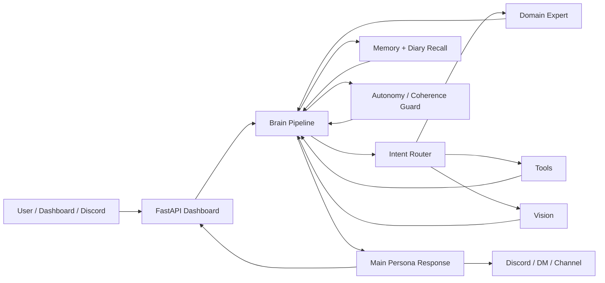

# 🧠 YourAI Neural Network

The central nervous system of the YourAI Ecosystem. This module connects **everything** — Memory, Vision, Voice, Tools, Discord, Dashboard, and more — into one modular AI pipeline.

> This is not a chatbot demo. It's a real, daily-use AI companion system with routing, expert models, memory, diary recall, tool use, and a full web dashboard. Built to be hacked, extended, and made your own.

---

## 🚨 Important: This is the GitHub (Sanitized) Version!

This repository is a **public, cleaned export** of a larger personal AI system. All private branding, prompts, secrets, state files, logs, voice data, and user data have been replaced with generic placeholders (`YourAI`, `your-domain.example.com`, etc.).

> Fork it, rename everything, swap the persona, and make it yours. That's the point.

---

## ✨ What Can It Do?

This thing does... a lot. Here's the short version:

- 🌐 **Web Dashboard** with chat, debug stream, config panel, TTS controls, usage counters, and admin commands.
- 🧠 **Brain Pipeline** — Routing → Expert Calls → Memory → Tools → Final Persona Response (powered by [LangGraph](https://github.com/langchain-ai/langgraph)).
- 🔀 **Intent Router** classifies every message into a domain (code, math, bio, med, anime, gaming, vision, etc.).
- 🎯 **Semantic Prompt Router** — Embeds user messages and injects only the relevant tool sections into the system prompt. Saves tokens, speeds up responses.
- 🧪 **Domain Experts** — Specialized models per domain (Qwen, Gemma, OLMo, RNJ-1, etc.) that feed facts to the main persona. Fully scalable — add new domains by adding a model + prompt.
- 🔄 **Expert Pool** — Monthly auto-refresh from LLM benchmark APIs with price cap per million tokens. Feedback-driven fallback chains (👎 → next model → `openrouter/auto` as last resort).
- 📔 **Episodic Diary** — Weekly rotation with keyword, regex, Cohere embedding, and Cohere reranking search. Nothing gets deleted, ever. Token-intensive? Yes. But **never again a full context window, never again an AI that forgets.**
- 🧩 **Hippocampus Memory** — Long-term memory with extraction, embedding, pre-filtering, deduplication, and relevance scoring. **Requires** the [finja-Memory](../finja-Open-Web-UI/finja-Memory/) server!
- 🛡️ **Autonomy Guard** — Protects the AI's positions and preferences. Binary CLEAR/CHALLENGED verdict via Phi 4. Enforced when Twitch is enabled.
- 🛡️ **Promises** — Protects the AI's promises THAT U MADE!.
- 🔧 **Tool System** — Web Search, File Brain, Spotify Control, Home Assistant, Paperless-NGX, Image Generation, Website Autonomy, and more.
- 👁️ **Vision** — Screenshot analysis (local) + URL vision (OpenRouter). Works headless in Docker.
- 🗣️ **TTS** — Browser TTS, ElevenLabs, DeepInfra Zonos voice cloning, XTTS local voice cloning with your own voice refs in `best_refs/`. Per-role monthly limits. Volume control for non-Docker setups.
- 🎮 **Discord** — Full integration with user sessions, private channels, DMs, custom emojis, stickers, and feedback reactions.
- 📡 **Streaming** — OpenRouter response streaming with tools firing on the first tag-token.
- 🐳 **Docker Deployment** with persistent volumes, live-mounted frontend, and health checks.
- 🎯 **Custom Exception System** — The AI receives its own structured error codes. No generic Python tracebacks — every module speaks the same error language.
- 🔐 **GDPR-Minded** — Dashboard and app are designed with data privacy in mind. Users can delete their own data.
- 🌍 **Run Anywhere** — Everything works via OpenRouter (recommended: enable **Zero Data Retention**!), but can also run **100% locally via Ollama**.

---

## 🏗️ Architecture



Every message flows through the Brain Pipeline:

1. Dashboard or Discord receives user input.
2. Runtime flags are hot-reloaded (dashboard toggles apply without restart).
3. Router classifies the request into a domain.
4. Memory + Diary search for relevant long-term context.
5. Expert models produce compact domain facts (if needed).
6. Tools fire when the message needs actions (web search, smart home, files, etc.).
7. Main persona model receives everything and generates the final response.
8. Response is sent back and logged for feedback.

**Key design choice:** Experts don't replace the persona. They feed it. The persona always owns the final voice.

---

## 🚨 Custom Exception System

Every module in the system uses a unified exception hierarchy (`core/exceptions.py`). The AI doesn't get generic Python tracebacks — it gets structured, human-readable error codes that it can understand and act on.

### Error Code Ranges

| Range | Category | Example |
| :--- | :--- | :--- |
| `YOURAI-1xx` | Config / Setup | Missing `.env` variable, missing package |
| `YOURAI-2xx` | LLM / Model | Timeout, rate limit, model not found, all tiers failed |
| `YOURAI-3xx` | Memory / Embedding | Embed failed, memory server unreachable |
| `YOURAI-4xx` | Session / Auth | User not found, no privilege, token expired |
| `YOURAI-5xx` | Tool / External | Tool execution failed, vision error |
| `YOURAI-6xx` | Pipeline / Flow | Autonomy guard error, safety filter error |
| `YOURAI-7xx` | Website / Web | Fetch failed, deploy failed, Cloudflare blocked |
| `YOURAI-8xx` | System / OS | Process killed, disk space, maintenance mode |
| `YOURAI-9xx` | Unexpected | Catch-all for anything else |

### Example: What the AI Actually Sees

When the Hippocampus memory system fails to connect, the AI doesn't get a raw Python traceback. It gets:

```
[YOURAI-303] Memory server error (status=None) [module=hippocampus] [url=http://memory-api:8007, status=None]
  (caused by ConnectionError: Cannot connect to host memory-api:8007)
```

The AI can then decide: notify the admin or do nothing (Autonomy!).

### The `[INEEDHELP]` Escape Hatch

When the persona LLM encounters an error it can't handle on its own, it can use the `[INEEDHELP]` tag in its response. This triggers a **Discord DM to the admin** with the error details — useful when you're not actively watching the dashboard but other users are hitting issues.

```
User asks: "What did we talk about last week?"
Memory server is down → AI gets YOURAI-303

AI responds to user: "Sorry, my memory is being a bit fuzzy right now — I'll get back to you!"
AI internally: [INEEDHELP] Memory server unreachable (YOURAI-303), diary recall failed for user request.

→ Admin gets a Discord DM:
  "⚠️ YOURAI-303: Memory server unreachable. User tried to access diary recall.
   Please check the memory container!"
```

This way the AI stays graceful to the user while making sure the problem gets fixed.

---

## 📂 Project Structure

| Path | Purpose |
| :--- | :--- |
| `dashboard_server.py` | FastAPI server — WebSocket chat, config API, admin commands, frontend serving |
| `core/brain.py` | Main AI pipeline (LangGraph) — routing, memory, experts, tools, final response |
| `core/config.py` | All config — feature flags, model settings, API endpoints, OpenRouter/Ollama |
| `core/exceptions.py` | Custom exception hierarchy — structured error codes for the entire system |
| `core/prompt_router.py` | Semantic prompt router — embeds messages, injects only relevant tool sections |
| `core/prompts.py` | System prompts and domain prompts |
| `core/autonomy_guard.py` | Autonomy Guardian — protects AI positions and preferences |
| `helpers/` | Debug logging, display, detection, user/session, persona, safety, feedback |
| `memory/episodic.py` | Episodic diary — weekly rotation, full search, Cohere reranking, summaries |
| `memory/hippocampus.py` | Long-term memory — extraction, embedding, relevance, dedup |
| `tools/` | Tool integrations (see below) |
| `body/` | Voice (mouth), hearing (ears), vision (eyes), Spotify context |
| `clients/` | Discord, Twitch, and dashboard helper clients |
| `frontend/` | Browser dashboard — chat, debug, config panel, TTS UI |
| `app/` | Additional FastAPI modules (auth, API routers) — 🚧 **WIP** |
| `docker/` | Dockerfile, Compose, entrypoint, VM deploy notes |
| `autonom_website/` | Local website files for autonomous website editing |
| `glorpo.py` / `glorpo-pkg/` / `glorpo-vscode/` | 🤪 **Glorpo** — an esoteric programming language (see below) |

---

## 🔧 Tools

All toggleable via `config.py` or the dashboard. Admin-only tools are marked.

| Tool | What It Does | Needs |
| :--- | :--- | :--- |
| **Web Search** | Docker-based web crawler with bearer auth | [finja-web-crawler](../finja-Open-Web-UI/finja-web-crawler/) |
| **File Brain** | Document chunking, chapter navigation, semantic search | — |
| **Spotify Control** | Shuffle, skip, pause, queue (Admin) | [finja-music-docker-spotify](../Finja-music/finja-music-docker-spotify/) |
| **Home Assistant** | Smart home control via HA API (Admin) | HA instance |
| **Paperless-NGX** | Document search via Paperless API (Admin) | Paperless instance |
| **Image Generation** | Via OpenRouter (SeedReam 4.5 etc.), per-role monthly limits | OpenRouter key (no ZDR model available — could combine with [finja-stable-diffusion](../finja-Open-Web-UI/finja-stable-diffusion/) for local gen!) |
| **Website Autonomy** | AI reads and updates its own website (HTML/CSS/JS) | Deploy endpoint |
| **Website Lab** | Unrestricted playground for experimental website changes | Deploy endpoint |
| **Discord DM** | Proactive DMs to whitelisted users + `[INEEDHELP]` alerts | Discord bot |
| **AltPersona Consult** | Consults an alternative persona for second opinions | — |

> ℹ️ The **Anime Expert** also uses Web Search for post-2023 knowledge as a safety net.

---

## ⚙️ Feature Switches

Everything is toggleable. Set in `config.py`, overridable at runtime via the dashboard (`runtime_config.json`).

| Flag | Default | What It Does | Notes |
| :--- | :--- | :--- | :--- |
| `USE_OPENROUTER` | auto | Cloud LLM via OpenRouter (auto-on when key is set) | **Recommended: Enable ZDR (Zero Data Retention)** in your [OpenRouter settings](https://openrouter.ai/settings/privacy)! Everything can also run 100% local via Ollama. |
| `USE_MEMORY` | ✅ | Long-term memory (Hippocampus) | **Requires** [finja-Memory](../finja-Open-Web-UI/finja-Memory/) server running! |
| `USE_EPISODIC` | ✅ | Diary logging and recall | Token-intensive with OpenRouter, but **10000% worth it** — never again a full context window, never again an AI that forgets! Uses Cohere embeddings + reranking for semantic search. |
| `USE_VISION` | ✅ | Screenshot analysis + URL vision | |
| `USE_VOICE` | ❌ | Speech recognition (Whisper) + TTS (XTTS) | ⚠️ Janky on Python 3.13! OFF for Docker by default. For Docker: use **DeepInfra** or **ElevenLabs** instead. Can use local voice refs in `best_refs/`. |
| `USE_DISCORD` | ✅ | Discord integration | |
| `USE_TOOLS` | ✅ | Tool invocation | |
| `USE_STREAMING` | ✅ | Stream OpenRouter responses | |
| `USE_THINKING` | ✅ | Thinking mode for supported models | Auto-detects model type (native, explicit, qwen, openrouter) |
| `USE_COHERENCE_CHECK` | ✅ | Autonomy Guardian | **Enforced when Twitch is enabled** — the AI must not go unprotected on a public stream! |
| `USE_PROMPT_ROUTER` | ✅ | Semantic prompt routing (token savings) | |
| `USE_SPOTIFY` | ✅ | Spotify music context | **Requires** [finja-music-docker-spotify](../Finja-music/finja-music-docker-spotify/) running! |
| `USE_WEB_SEARCH` | ✅ | Web search tool | **Requires** [finja-web-crawler](../finja-Open-Web-UI/finja-web-crawler/) running! |
| `USE_PAPERLESS` | ✅ | Paperless-NGX documents (Admin) | |
| `USE_HOME_ASSISTANT` | ✅ | Home Assistant (Admin) | |
| `USE_IMAGE_GEN` | ✅ | Image generation via OpenRouter | No ZDR model available yet. Per-role monthly budget limits. |
| `USE_GRANITE` | ❌ | Safety filter | **Required for Twitch!** Config enforces this at startup. |
| `USE_MAINTENANCE` | ❌ | Maintenance mode for non-admins | |

---

## 🧪 Expert System

The expert system is **fully scalable**. Adding a new domain is as simple as:
1. Add a model mapping in `EXPERT_MODELS` (local) and/or `EXPERT_OPENROUTER_OVERRIDES` (cloud)
2. Add a system prompt in `core/prompts.py`
3. Add the domain to the router

### Current Domains

`bio` · `med` · `physics` · `chemie` · `code` · `math` · `baking` · `gaming` · `anime` · `fox_philosophy` · `smalltalk` · `fallback`

### Expert Pool (Auto-Refresh)

The expert pool refreshes monthly from LLM benchmark APIs:

1. Query benchmark/ranking API per domain
2. Filter by **price cap** (`EXPERT_POOL_PRICE_CAP_USD_PER_M`, default: $0.60/M tokens)
3. Pick top N models per domain
4. Append configured safety fallbacks
5. `openrouter/auto` as last resort
6. Save `expert_model_pool.json` + MD5 lock file

**Feedback loop:** When users give 👎 on an expert response, the system automatically falls to the next model in the chain. No manual intervention needed.

---

## 🐳 Docker Quick Start

### Requirements
- Docker with Compose v2
- An OpenRouter API key (for cloud models) — **enable ZDR!**
- Optional: Cohere, Discord, Paperless, Home Assistant, Spotify, ElevenLabs, DeepInfra keys

### Setup

```powershell
cd path\to\yourai-neural-network
Copy-Item .env.example docker\data\.env
Copy-Item access_keys.example.json docker\data\access_keys.json
Copy-Item users_db.example.json docker\data\users_db.json
```

Edit `docker/data/.env`, `docker/data/access_keys.json`, and `docker/data/users_db.json` with your keys.

### Run

```powershell
docker compose -f docker/docker-compose.yml up -d --build
```

### Open

```
http://localhost:8051?key=YOUR_ACCESS_KEY
```

### Logs / Stop

```powershell
docker compose -f docker/docker-compose.yml logs -f
docker compose -f docker/docker-compose.yml down
```

---

## 🐍 Local Python Run

Docker is recommended, but local works too:

```powershell
python -m venv .venv
.\.venv\Scripts\Activate.ps1
pip install -r requirements.txt
Copy-Item .env.example .env
python dashboard_server.py
```

> ⚠️ **PyTorch** must be installed separately depending on your GPU! See `requirements.txt` for CUDA vs CPU instructions.

---

## 🔑 Configuration (.env)

```ini
OPENROUTER_API_KEY=your_key          # Required for cloud models
LLM_HOST_MAIN=http://YOUR_HOST:11434 # Ollama host for large local models
MEMORY_API_BASE=http://HOST:8007     # Memory server (finja-Memory)
MEMORY_API_KEY=your_key              # Memory API key
COHERE_API_KEY=your_key              # Diary semantic search + reranking
ELEVENLABS_API_KEY=your_key          # Premium TTS
DEEPINFRA_API_KEY=your_key           # Zonos voice cloning (recommended for Docker!)
DISCORD_TOKEN=your_token             # Discord bot
HOMEASSISTANT_URL=http://HOST:8123   # Smart Home
HOMEASSISTANT_TOKEN=your_token       # HA long-lived access token
PAPERLESS=your_token                 # Paperless-NGX API
LLM_STATS_API_KEY=your_key           # Expert pool benchmark refresh
```

> ⚠️ **Never commit** `.env`, `access_keys.json`, `users_db.json`, or anything in `docker/data/`. Keep it in `.gitignore`!

---

## 🎨 Customizing The Persona

This export uses placeholder branding. Before running as your own assistant, review and replace:

- `core/prompts.py` — System prompts and personality
- `core/config.py` — Model choices, branding headers, URLs
- `helpers/personas.py` — Persona definitions
- `frontend/index.html` — Dashboard branding
- `frontend/privacy.html` / `terms.html` — Legal pages
- Discord settings (channel IDs, emojis, stickers)

The persona LLM also understands and can use **commands** within its responses:
- `[DM:TargetUser]` — Send a Discord DM to a whitelisted user
- `[INEEDHELP]` — Alert the admin via Discord DM about an error
- Tool tags — Trigger tools inline during response generation

---

## 🤪 Glorpo — An Esoteric Programming Language

Yes, this repo includes an **esolang**. Glorpo is basically Brainfuck for Python — it replaces every Python keyword with alien-gremlin-speak and runs it through a native Python interpreter.

```python
# Python
def hello():
    print("Hi!")

# Glorpo
gloo hello():
    glorp("Hi!")
```

Some highlights from the dictionary: `raise` → `glorpyeet`, `return` → `glorpback`, `min` → `glorpsmol`, `max` → `glorpchonk`, `append` → `glorpshove`, `pop` → `glorpyoink`.

Includes a full transpiler (`glorpo.py`), a pip package (`glorpo-pkg/`), and a **VS Code syntax highlighter** (`glorpo-vscode/`). Because why not.

Inspired by [Magic The Noah](https://www.youtube.com/@MagicTheNoah) — "Glorpo is pain."

---

## 🛡️ Security Notes

This system calls tools, writes files, and exposes a dashboard. **Do not put it on the public internet** without:

- Strong access keys (admin ≠ chat keys)
- HTTPS + reverse proxy
- Rate limiting
- Disabled unused integrations
- VPN / tunnel for the dashboard
- Reviewed prompts and tool permissions
- OpenRouter ZDR enabled

---

## 💖 Acknowledgments

This project stands on the shoulders of some amazing open-source tools and services:

| What | Used For |
| :--- | :--- |
| [LangChain](https://github.com/langchain-ai/langchain) / [LangGraph](https://github.com/langchain-ai/langgraph) | Brain pipeline orchestration |
| [Ollama](https://ollama.com) | Local LLM hosting |
| [OpenRouter](https://openrouter.ai) | Cloud LLM routing + image generation |
| [FastAPI](https://fastapi.tiangolo.com) | Dashboard server + API |
| [Cohere](https://cohere.com) | Multilingual embeddings + reranking for diary search |
| [ElevenLabs](https://elevenlabs.io) | Premium TTS |
| [DeepInfra](https://deepinfra.com) | Zonos voice cloning |
| [Coqui XTTS](https://github.com/coqui-ai/TTS) | Local voice cloning |
| [discord.py](https://github.com/Rapptz/discord.py) | Discord integration |
| [Faster Whisper](https://github.com/SYSTRAN/faster-whisper) | Speech recognition |
| [Paperless-NGX](https://github.com/paperless-ngx/paperless-ngx) | Document management integration |
| [Home Assistant](https://www.home-assistant.io) | Smart home integration |
| [Pillow](https://pillow.readthedocs.io) / [mss](https://github.com/BoboTiG/python-mss) | Vision / screenshot capture |
| [colorama](https://github.com/tartley/colorama) | Terminal colors |
| [Magic The Noah](https://www.youtube.com/@MagicTheNoah) | Glorpo inspiration — "Glorpo is pain." |

---

## 📄 License

MIT © 2026 J. Apps (JohnV2002 / Sodakiller1)

**You are free to:**
- ✅ Use this code commercially
- ✅ Modify and adapt it
- ✅ Distribute and sell it
- ✅ Use it in closed-source projects

**The only requirement:**
- ⭐ **Keep the attribution visible** — The "Made with ❤️ by Sodakiller1" credit must remain in the UI - WIP!!

**Why attribution matters:**
Money comes and goes, but **reputation is gold**. This project is free for everyone, but credit keeps the open-source spirit alive and helps others discover the project.

**Links:**
- 🎮 Twitch: [twitch.tv/sodakiller1](https://twitch.tv/sodakiller1)
- 💼 Company: J. Apps
- 👤 GitHub: [JohnV2002](https://github.com/JohnV2002)

---

## 🆘 Support & Contact

-   **Email:** contact@jappshome.de
-   **Website:** [jappshome.de](https://jappshome.de)
-   **Support:** [Buy Me a Coffee](https://buymeacoffee.com/J.Apps)
