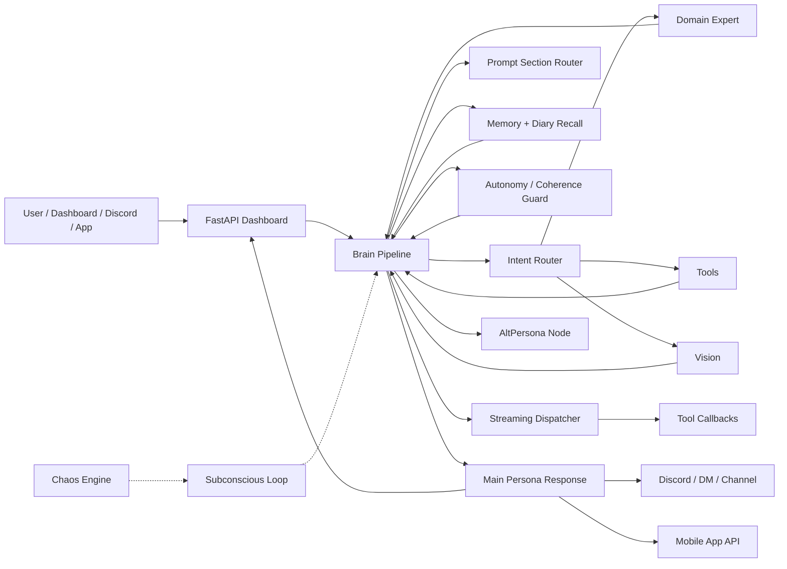

# 🧠 YourAI Neural Network

A self-hosted AI companion stack with a web dashboard, long-term memory, diary recall, expert routing, autonomous behavior, mobile app API, Discord/Twitch integration, TTS, image generation, tool use, and Docker deployment.

This repository is a public, sanitized export of a larger personal AI ecosystem. It is meant to be a serious starting point for people who want to run and customize their own always-on AI companion instead of a tiny chatbot demo.

> This project is not a polished SaaS template. It is a real working system that grew around daily use: messy in places, ambitious everywhere, and designed to be hackable.

---

## 🔗 Related Modules

This repository is part of the **Finja AI Ecosystem**. Other modules live in sibling folders:

| Module | Purpose |
| :--- | :--- |
| [`finja-Open-Web-UI/finja-Memory`](../finja-Open-Web-UI/finja-Memory) | External memory server for the Adaptive Memory OpenWebUI plugin |
| [`finja-Open-Web-UI`](../finja-Open-Web-UI) | OpenWebUI plugins and configurations |
| [`finja-Open-Web-UI/finja-web-crawler`](../finja-Open-Web-UI/finja-web-crawler) | Docker-based web crawler with bearer auth |
| [`finja-music-docker-spotify`](../Finja-music/finja-music-docker-spotify) | Spotify Docker integration (shuffle, skip, pause, queue) |
| [`finja-stable-diffusion`](../finja-Open-Web-UI/finja-stable-diffusion) | Local image generation (alternative to OpenRouter) |
| [`finja-neural-network`](./) | This repo — the main AI brain, dashboard, and companion stack |

---

## 🌐 What This Is

YourAI Neural Network is a modular AI "nervous system". The core idea is simple:

The main persona should not do everything alone. It gets help from specialized subsystems: a router, expert models, memory, diary search, tools, safety checks, autonomous background loops, and optional integrations. The final response still feels like one assistant, but the work behind it is split across small nodes.



---

## ✨ Highlights

### 🖥️ Dashboard & Backend
- Web dashboard with chat, debug stream, config panel, model visibility, TTS controls, usage counters, analytics, and admin commands
- FastAPI backend with WebSocket chat events, streaming response dispatch, and filtered per-user event delivery
- Dashboard analytics with metrics collection, daily rollups, cost estimates, and alert summaries

### 🧠 Brain Pipeline
- Main brain pipeline built around routing, expert calls, memory lookup, tool invocation, streaming tool callbacks, and final persona response
- Semantic prompt router that classifies messages and injects only relevant prompt sections, reducing token usage
- Streaming dispatcher that detects tool tags in LLM output and fires callback handlers without blocking text delivery
- Structured exception hierarchy with dashboard-friendly error formatting

### 📚 Memory & Diary
- Episodic diary system for durable personal context
- Hybrid diary recall using keyword/regex matching plus optional Cohere multilingual embeddings and reranking
- Hippocampus-style long-term memory

### 🤖 Expert System
- Dynamic expert model pool with monthly LLM benchmark refresh, MD5 lock file, price cap, and feedback-aware fallbacks
- Feedback system where repeated thumbs-down can move an expert domain to the next model
- OpenRouter support for cloud models plus local Ollama fallback models

### 🌀 Autonomy & Subconscious
- Chaos engine with entropy-based timing, mood tracking, cooldowns, and curiosity pressure
- Subconscious background loop for autonomous actions (YouTube, Instagram, music, diary reflection)
- Coherence guard that evaluates whether requests conflict with stated positions

### 👤 AltPersona
- Secondary uncensored personality with separate diary context and model chain
- Internal consultation tool for the main persona to ask AltPersona for advice

### 📱 Mobile App API
- Device linking via one-time pairing codes
- FCM push notifications
- Mood endpoint, profile aggregation, image uploads, chat log with interaction streaks
- GDPR/DSGVO compliance (Art. 15 data portability, Art. 17 data erasure)

### 🎮 Integrations
- Discord client with user sessions, private-channel flows, custom emojis, stickers, platform linking, and feedback reactions
- Twitch client support
- Spotify integration with rate-limited track data, listening phase detection, and playback context for LLM prompts
- Optional Home Assistant, Paperless-NGX, web search, and website autonomy tools

### 🔊 Voice & TTS
- Local voice cloning via Coqui XTTS v2
- Resemble AI (Chatterbox) cloud TTS with voice cloning
- ElevenLabs premium TTS
- DeepInfra Zonos voice cloning fallback
- Browser playback with volume control
- Separate TTS microservice (`mouth_server.py`) for VM deployment

### 🎨 Creative Tools
- Image generation with per-role monthly limits
- Website autonomy with protected markers for the main site
- Website lab: unrestricted creative playground (games, art, experiments)
- Glorpo esoteric programming language with Python transpiler, C++ interpreter, native compiler, PHP web frontend, and VS Code extension

### 🔍 Observability
- Per-user writing style profiling and analysis
- Centralized error inbox with deduplication and trending
- Debug event stream with pipeline telemetry

### 🐳 Deployment
- Docker deployment with persistent state, analytics storage, and live-mounted frontend/website files
- Separate Docker containers for YouTube and Instagram autonomous browsing

---

## 🚦 Project Status

This is an advanced hobby/solo-dev AI system, not a beginner package.

Expect to edit configuration, swap models, provide your own API keys, and adapt deployment paths. The public export intentionally replaces private branding, prompts, secrets, state files, logs, voice data, and user data with placeholders.

**Good fit if you want:**
- A personal AI companion architecture you can study and modify
- A local-first / self-hosted dashboard for your own AI
- A project that already includes memory, diary recall, tools, Discord, TTS, model routing, autonomous behavior, and mobile app support
- A codebase that prioritizes experimentation over minimalism

**Not a good fit if you want:**
- A one-click hosted chatbot
- A tiny tutorial app
- Production guarantees
- A fully neutral assistant with no persona system

---

## 📂 Repository Layout

<details>
<summary><b>🖥️ Dashboard & Server</b></summary>

| Path | Purpose |
| :--- | :--- |
| [`dashboard_server.py`](dashboard_server.py) | FastAPI dashboard server, WebSocket handling, config APIs, admin actions, frontend serving |
| [`dashboard_analytics.py`](dashboard_analytics.py) | Metrics collection, daily rollups, cost estimates, alert summaries |
| [`dashboard_models.py`](dashboard_models.py) | Shared data models: `EventType` enum and `DebugEvent` dataclass |
| [`dashboard_process.py`](dashboard_process.py) | Brain subprocess management with active model detection |
| [`dashboard_runtime.py`](dashboard_runtime.py) | Runtime config helpers for 30+ feature flags |
| [`dashboard_session.py`](dashboard_session.py) | Session and token helpers |

</details>

<details>
<summary><b>🧠 Core</b></summary>

| Path | Purpose |
| :--- | :--- |
| [`core/brain.py`](core/brain.py) | Main AI pipeline: routing, memory, expert calls, tools, streaming, final response |
| [`core/config.py`](core/config.py) | Feature flags, model settings, API endpoints, OpenRouter/Ollama configuration |
| [`core/prompts/`](core/prompts/) | Prompt package: [`core.py`](core/prompts/core.py), [`sections.py`](core/prompts/sections.py), [`experts.py`](core/prompts/experts.py), [`altpersona.py`](core/prompts/altpersona.py) |
| [`core/prompt_router.py`](core/prompt_router.py) | Semantic classifier that selects which prompt sections to inject |
| [`core/streaming.py`](core/streaming.py) | Streaming response dispatcher detecting tool tags |
| [`core/tool_callbacks.py`](core/tool_callbacks.py) | Fire-and-forget handlers for streaming tool tags |
| [`core/autonomy_guard.py`](core/autonomy_guard.py) | Coherence guard for request evaluation |
| [`core/yourai_chaos_engine.py`](core/yourai_chaos_engine.py) | Entropy-based timing and decision engine |
| [`core/yourai_subconscious.py`](core/yourai_subconscious.py) | Background autonomy loop |
| [`core/instagram_client.py`](core/instagram_client.py) | HTTP client for Instagram Docker browsing container |
| [`core/youtube_client.py`](core/youtube_client.py) | HTTP client for YouTube Docker browsing container |
| [`core/exceptions.py`](core/exceptions.py) | Structured exception hierarchy |
| [`core/input_loop.py`](core/input_loop.py) | Terminal input loop |
| [`altpersona.py`](altpersona.py) | AltPersona personality nodes |

</details>

<details>
<summary><b>🛠️ Tools</b></summary>

| Path | Purpose |
| :--- | :--- |
| [`tools/tool_router.py`](tools/tool_router.py) | Tool routing and dispatch |
| [`tools/web_search.py`](tools/web_search.py) | Web search integration |
| [`tools/file_brain.py`](tools/file_brain.py) | File reading and analysis tool |
| [`tools/file_brain_chunking.py`](tools/file_brain_chunking.py) | File chunking utilities |
| [`tools/image_gen.py`](tools/image_gen.py) | Image generation |
| [`tools/image_limits.py`](tools/image_limits.py) | Per-role image generation limits |
| [`tools/tts_yourai.py`](tools/tts_yourai.py) | Resemble AI (Chatterbox) TTS |
| [`tools/tts_elevenlabs.py`](tools/tts_elevenlabs.py) | ElevenLabs premium TTS |
| [`tools/tts_limits.py`](tools/tts_limits.py) | TTS usage limits |
| [`tools/spotify_control.py`](tools/spotify_control.py) | Spotify playback control |
| [`tools/paperless.py`](tools/paperless.py) | Paperless-NGX document lookup |
| [`tools/home_assistant.py`](tools/home_assistant.py) | Home Assistant smart home control |
| [`tools/website_autonomy.py`](tools/website_autonomy.py) | Autonomous website updates (protected markers) |
| [`tools/website_autonomy_lab.py`](tools/website_autonomy_lab.py) | Unrestricted creative playground |
| [`tools/website_autonomy_utils.py`](tools/website_autonomy_utils.py) | Shared website autonomy utilities |
| [`tools/expert_pool.py`](tools/expert_pool.py) | Dynamic expert model pool management |
| [`tools/cohere_embeddings.py`](tools/cohere_embeddings.py) | Cohere embedding helpers |
| [`tools/reranker.py`](tools/reranker.py) | Cohere reranker for diary search |
| [`tools/altpersona_consult.py`](tools/altpersona_consult.py) | AltPersona internal consultation tool |
| [`tools/glorpo_html_tool.py`](tools/glorpo_html_tool.py) | Glorpo HTML conversion tool |
| [`tools/discord_dm.py`](tools/discord_dm.py) | Discord DM tool |
| [`tools/website.py`](tools/website.py) | Website inspection tool |

</details>

<details>
<summary><b>📚 Memory</b></summary>

| Path | Purpose |
| :--- | :--- |
| [`memory/hippocampus.py`](memory/hippocampus.py) | Long-term memory context |
| [`memory/episodic.py`](memory/episodic.py) | Diary entries and archived diary lookup |
| [`memory/episodic_utils.py`](memory/episodic_utils.py) | Week ID and date calculation helpers |
| [`memory/debug_client.py`](memory/debug_client.py) | Optional dashboard debug access for memory modules |

</details>

<details>
<summary><b>🔊 Body (Senses)</b></summary>

| Path | Purpose |
| :--- | :--- |
| [`body/mouth.py`](body/mouth.py) | Coqui XTTS v2 speech synthesis |
| [`body/ears.py`](body/ears.py) | Speech recognition |
| [`body/eyes.py`](body/eyes.py) | Vision / screenshot capture |
| [`body/vision_clients.py`](body/vision_clients.py) | OpenRouter and Ollama vision API clients |
| [`body/spotify.py`](body/spotify.py) | Spotify track data with rate limiting |
| [`body/spotify_context.py`](body/spotify_context.py) | Spotify prompt context and listening phase detection |
| [`body/audio_temp.py`](body/audio_temp.py) | Temporary audio file management |
| [`mouth_server.py`](mouth_server.py) | Standalone XTTS microservice for VM deployment |

</details>

<details>
<summary><b>🎮 Clients</b></summary>

| Path | Purpose |
| :--- | :--- |
| [`clients/discord_client.py`](clients/discord_client.py) | Discord bot client |
| [`clients/discord_channels.py`](clients/discord_channels.py) | Discord channel utilities |
| [`clients/discord_messages.py`](clients/discord_messages.py) | Discord message handling |
| [`clients/discord_media.py`](clients/discord_media.py) | Discord media handling |
| [`clients/discord_send.py`](clients/discord_send.py) | Discord delivery logic |
| [`clients/twitch_client.py`](clients/twitch_client.py) | Twitch integration |
| [`clients/dashboard_client.py`](clients/dashboard_client.py) | Dashboard metrics/logging/event dispatch client |
| [`clients/dashboard_images.py`](clients/dashboard_images.py) | Base64 image persistence for frontend |

</details>

<details>
<summary><b>📱 Mobile App API</b></summary>

| Path | Purpose |
| :--- | :--- |
| [`app/app_api.py`](app/app_api.py) | App API router |
| [`app/auth.py`](app/auth.py) | Authentication |
| [`app/identity.py`](app/identity.py) | Platform-to-user mapping (Web, App, Discord, device keys) |
| [`app/linking.py`](app/linking.py) | Device pairing via one-time codes |
| [`app/mood.py`](app/mood.py) | Current emotional state for mobile rendering |
| [`app/privacy.py`](app/privacy.py) | GDPR/DSGVO compliance (Art. 15 + Art. 17) |
| [`app/profile.py`](app/profile.py) | Consolidated profile (tokens, style, streaks, limits) |
| [`app/push.py`](app/push.py) | FCM push notification token management |
| [`app/uploads.py`](app/uploads.py) | Temporary image upload with 1-hour expiry |
| [`app/versioning.py`](app/versioning.py) | Version endpoint with MD5 integrity check |
| [`app/chat_log.py`](app/chat_log.py) | Chat log parsing with interaction streaks |

</details>

<details>
<summary><b>🧩 Helpers</b></summary>

| Path | Purpose |
| :--- | :--- |
| [`helpers/detection.py`](helpers/detection.py) | Promise, diary request, and intent signal detection |
| [`helpers/error_inbox.py`](helpers/error_inbox.py) | Centralized error tracking with deduplication |
| [`helpers/style_analyzer.py`](helpers/style_analyzer.py) | Per-user writing style profiling |
| [`helpers/platform_links.py`](helpers/platform_links.py) | Cross-platform account linking |
| [`helpers/feedback.py`](helpers/feedback.py) | Anonymous thumbs-up/thumbs-down feedback |
| [`helpers/personas.py`](helpers/personas.py) | Persona management |
| [`helpers/session.py`](helpers/session.py) | Session helpers |
| [`helpers/users.py`](helpers/users.py) | User management |

</details>

<details>
<summary><b>🎨 Frontend</b></summary>

| Path | Purpose |
| :--- | :--- |
| [`frontend/`](frontend/) | Browser dashboard: chat, debug view, config panel, TTS UI, profile, analytics, chat history |
| [`frontend/index.html`](frontend/index.html) | Main dashboard page |
| [`frontend/analytics.js`](frontend/analytics.js) | Analytics visualization |
| [`frontend/chat_history.js`](frontend/chat_history.js) | Chat history management |
| [`frontend/config.js`](frontend/config.js) | Config panel |

</details>

<details>
<summary><b>🌐 Website Autonomy</b></summary>

| Path | Purpose |
| :--- | :--- |
| [`autonom_website/`](autonom_website/) | Local website files for autonomous editing |
| [`website_lab/`](website_lab/) | Creative playground (games, art, experiments) |

</details>

<details>
<summary><b>🗣️ Glorpo Language</b></summary>

| Path | Purpose |
| :--- | :--- |
| [`glorpo.py`](glorpo.py) | Python transpiler (`if` -> `glorb`, `def` -> `glorpdef`, etc.) |
| [`glorpo_html.py`](glorpo_html.py) | HTML tag mapping (`div` -> `glorpbox`, `h1` -> `glorphat`) |
| [`glorpo-pkg/`](glorpo-pkg/) | Installable Python package |
| [`glorpo-vscode/`](glorpo-vscode/) | VS Code extension with `.glp` syntax highlighting |
| [`glorpo/glorpo-interp/`](glorpo/glorpo-interp/) | Full C++ interpreter |
| [`glorpo/glorpo-native/`](glorpo/glorpo-native/) | Native compiler with CMake |
| [`glorpo/glorpo-front/`](glorpo/glorpo-front/) | PHP web frontend |

</details>

<details>
<summary><b>🐳 Docker & Data</b></summary>

| Path | Purpose |
| :--- | :--- |
| [`docker/`](docker/) | Dockerfile, compose file, entrypoint, VM deployment notes |
| [`docker_data/`](docker_data/) | Persistent analytics, error inbox, user styles, FCM tokens, platform links |
| [`best_refs/`](best_refs/) | Placeholder for voice reference files (not included) |
| [`app_version.txt`](app_version.txt) | Version `1.0.0+10001` with MD5 lock file |

</details>

---

## ⚙️ How The Brain Works

At a high level, every message goes through a pipeline:

1. The dashboard, Discord, or mobile app client receives user input.
2. The brain reloads runtime flags so dashboard toggles apply without editing source code.
3. The **prompt router** classifies the message and selects which prompt sections to inject, reducing token usage.
4. The **intent router** classifies the request into a domain (code, math, bio, med, anime, gaming, vision, fallback...).
5. **Memory and diary** systems search for relevant long-term context.
6. Optional **expert nodes** produce compact facts or structured help.
7. Optional **tools** run when the message requests actions (web search, files, smart home, documents, website changes, AltPersona consultation...).
8. The **streaming dispatcher** detects tool tags in the response and fires callback handlers without blocking text output.
9. The **autonomy guard** checks whether the request conflicts with stated positions.
10. The **main persona model** receives the user message plus selected context and expert facts.
11. The final answer is sent back to the dashboard/Discord/app and logged for feedback.

> The important design choice is that experts do not replace the main persona. They feed it facts. The main persona still owns the final voice.

---

## 🌀 Autonomy And Subconscious

The system includes an autonomous background loop that can trigger low-probability actions on its own:

- **Chaos Engine** ([`core/yourai_chaos_engine.py`](core/yourai_chaos_engine.py)): Entropy-based timing and decision engine. Tracks mood, cooldowns, curiosity pressure, and generates dice rolls (d20, w6, w4) for heartbeat timing.
- **Subconscious Loop** ([`core/yourai_subconscious.py`](core/yourai_subconscious.py)): Periodically evaluates autonomous actions — browsing YouTube Shorts, scrolling Instagram Reels, reflecting on diary entries, or interacting with music. Runs in background threads respecting cooldowns and token budgets.
- **Autonomy Guard** ([`core/autonomy_guard.py`](core/autonomy_guard.py)): Evaluates whether user requests conflict with the AI's stated positions. Returns CLEAR or CHALLENGED outcomes with dashboard logging.

---

## 👤 AltPersona System

AltPersona is a secondary personality node ([`altpersona.py`](altpersona.py)) with its own uncensored model chain and separate diary context. It can be invoked directly or consulted as an internal advisor through [`tools/altpersona_consult.py`](tools/altpersona_consult.py). The main persona decides whether to incorporate AltPersona's input into the final response.

---

## 📚 Memory And Diary

- [`memory/hippocampus.py`](memory/hippocampus.py) — long-term memory context
- [`memory/episodic.py`](memory/episodic.py) — diary entries and archived diary lookup
- [`memory/episodic_utils.py`](memory/episodic_utils.py) — week ID and date calculation helpers

Diary recall uses multiple signals:
- Keyword and regex-based candidate gathering
- Optional semantic search using Cohere `embed-multilingual-v3.0`
- Optional reranking with Cohere rerank models
- Signal overlap boosting when keyword and embedding search find the same diary entry

```env
COHERE_API_KEY=your_cohere_api_key_here
COHERE_EMBED_MODEL=embed-multilingual-v3.0
USE_DIARY_SEMANTIC_SEARCH=1
DIARY_SEMANTIC_CANDIDATE_LIMIT=160
DIARY_SEMANTIC_TOP_N=24
DIARY_SEMANTIC_MIN_SCORE=0.18
```

Without a Cohere key, the system falls back to non-semantic paths.

---

## 🤖 Expert Model Pool

The expert system can use static model chains or a generated expert pool. The pool is stored as JSON with a matching MD5 lock file so the dashboard can show whether the pool is valid.

Monthly refresh flow:
1. Query an LLM benchmark/ranking API
2. Filter candidates by domain and price cap
3. Pick the top models per domain
4. Append configured safety fallbacks
5. Keep `openrouter/auto` as the last-resort route
6. Save `expert_model_pool.json` and `.lock`

```env
LLM_STATS_API_KEY=your_llm_stats_api_key_here
LLM_STATS_BASE_URL=https://llm-stats.com
EXPERT_POOL_PRICE_CAP_USD_PER_M=0.60
EXPERT_POOL_TOP_N=3
```

If the API key is missing or the schema changes, the system writes a static fallback pool.

---

## 🔊 Voice And TTS

The project supports multiple TTS providers:

| Provider | Type | Notes |
| :--- | :--- | :--- |
| [Coqui XTTS v2](https://github.com/coqui-ai/TTS) | Local | Voice cloning via [`body/mouth.py`](body/mouth.py) and [`mouth_server.py`](mouth_server.py) |
| [Resemble AI (Chatterbox)](https://www.resemble.ai) | Cloud | Direct API via [`tools/tts_yourai.py`](tools/tts_yourai.py) |
| [ElevenLabs](https://elevenlabs.io) | Cloud | Premium TTS via [`tools/tts_elevenlabs.py`](tools/tts_elevenlabs.py) |
| [DeepInfra (Zonos)](https://deepinfra.com) | Cloud | Voice cloning fallback |

Place your own clean voice references in [`best_refs/`](best_refs/) if you use XTTS-style cloning. Do not publish voice reference files unless you have the rights to do so.

---

## 🖥️ Dashboard

The dashboard is served on port `8051` by default.

```
http://localhost:8051?key=YOUR_ACCESS_KEY
```

Main areas:
- **Chat tab** — talk to the assistant, upload files/images, use TTS, submit feedback
- **Debug tab** — inspect pipeline events, LLM calls, node timings, errors, system messages
- **Config tab** — toggle features, inspect active models, refresh expert pool, control TTS volume, view usage
- **Analytics** — metrics visualization, cost tracking, alert summaries
- **Chat history** — browse and search past conversations

Access is key-based. Start from [`access_keys.example.json`](access_keys.example.json), create your own `access_keys.json`, and never commit real keys.

---

## 📱 Mobile App API

The [`app/`](app/) package provides a full REST API for mobile clients:

| Endpoint | Purpose |
| :--- | :--- |
| `GET /api/app/me` | Consolidated profile (tokens, style, streaks, limits) |
| `POST /api/app/link` | Device pairing via one-time code |
| `GET /api/app/mood` | Current AI emotional state |
| `POST /api/app/push/register` | Register FCM token for push notifications |
| `GET /api/app/version` | Public version with integrity check |
| `GET /api/app/privacy/export` | GDPR Art. 15 data export |
| `DELETE /api/app/privacy/erase` | GDPR Art. 17 data erasure |

---

## ⚠️ YouTube & Instagram Autonomy — Use At Your Own Risk

The YouTube ([`core/youtube_client.py`](core/youtube_client.py)) and Instagram ([`core/instagram_client.py`](core/instagram_client.py)) autonomous browsing clients connect to separate Docker containers that use headless browser sessions to browse, analyze screenshots, and interact with content.

> **These modules will be uploaded in a separate folder in the future.**

### 🚨 Important Disclaimer

**Using automated browsing on YouTube and Instagram violates their Terms of Service. Your account can be banned, rate-limited, or permanently suspended.**

I provide the code as-is for educational and experimental purposes. **Every user is solely responsible for how they use it.** I take no responsibility for any consequences including account bans, legal issues, or data loss.

- Do **not** use this on your main accounts
- Do **not** use this at scale
- Do **not** blame me if you get banned
- **You have been warned.**

---

## 🤪 Glorpo — An Esoteric Programming Language

Yes, this repo includes an **esolang**. Glorpo is basically Brainfuck for Python — it replaces every Python keyword with alien-gremlin-speak and runs it through a native Python interpreter.

```python
# Python
def hello():
    print("Hi!")

# Glorpo
gloo hello():
    glorp("Hi!")
```

Some highlights from the dictionary: `raise` -> `glorpyeet`, `return` -> `glorpback`, `min` -> `glorpsmol`, `max` -> `glorpchonk`, `append` -> `glorpshove`, `pop` -> `glorpyoink`.

| Component | What |
| :--- | :--- |
| [`glorpo.py`](glorpo.py) | Python transpiler (`if` -> `glorb`, `def` -> `glorpdef`) |
| [`glorpo_html.py`](glorpo_html.py) | HTML tag mapping (`div` -> `glorpbox`, `h1` -> `glorphat`) |
| [`glorpo-pkg/`](glorpo-pkg/) | Installable pip package |
| [`glorpo-vscode/`](glorpo-vscode/) | VS Code syntax highlighter for `.glp` files |
| [`glorpo/glorpo-interp/`](glorpo/glorpo-interp/) | Full C++ interpreter |
| [`glorpo/glorpo-native/`](glorpo/glorpo-native/) | Native compiler (CMake) |
| [`glorpo/glorpo-front/`](glorpo/glorpo-front/) | PHP web frontend |

Inspired by [Magic The Noah](https://www.youtube.com/@MagicTheNoah) — "Glorpo is pain."

---

## 🐳 Docker Quick Start

**Requirements:**
- Docker with Compose v2
- An OpenRouter API key if you want cloud models
- Optional: Cohere, Discord, Paperless, Home Assistant, Spotify, TTS, and image provider keys

**Setup:**

```powershell
cd path\to\yourai-neural-network
Copy-Item .env.example docker\data\.env
Copy-Item access_keys.example.json docker\data\access_keys.json
Copy-Item users_db.example.json docker\data\users_db.json
```

Edit `docker/data/.env`, `docker/data/access_keys.json`, and `docker/data/users_db.json`.

**Start:**
```powershell
docker compose -f docker/docker-compose.yml up -d --build
```

**Logs:**
```powershell
docker compose -f docker/docker-compose.yml logs -f
```

**Stop:**
```powershell
docker compose -f docker/docker-compose.yml down
```

**Open:**
```
http://localhost:8051?key=YOUR_ACCESS_KEY
```

---

## 🐍 Local Python Run

Docker is recommended, but local Python can work:

```powershell
python -m venv .venv
.\.venv\Scripts\Activate.ps1
pip install -r requirements.txt
Copy-Item .env.example .env
python dashboard_server.py
```

Local runs expect state files in the project root:
- `access_keys.json`
- `users_db.json`
- `runtime_config.json`
- Optional diary/memory/state files

---

## 🔑 Configuration (.env)

```ini
OPENROUTER_API_KEY=your_key          # Required for cloud models
LLM_HOST_MAIN=http://YOUR_HOST:11434 # Ollama host for large local models
MEMORY_API_BASE=http://HOST:8007     # Memory server (finja-Memory)
MEMORY_API_KEY=your_key              # Memory API key
COHERE_API_KEY=your_key              # Diary semantic search + reranking
ELEVENLABS_API_KEY=your_key          # Premium TTS
DEEPINFRA_API_KEY=your_key           # Zonos voice cloning (recommended for Docker!)
RESEMBLE_API_KEY=your_key            # Chatterbox TTS
DISCORD_TOKEN=your_token             # Discord bot
HOMEASSISTANT_URL=http://HOST:8123   # Smart Home
HOMEASSISTANT_TOKEN=your_token       # HA long-lived access token
PAPERLESS=your_token                 # Paperless-NGX API
LLM_STATS_API_KEY=your_key           # Expert pool benchmark refresh
```

> ⚠️ **Never commit** `.env`, `access_keys.json`, `users_db.json`, or anything in `docker/data/`. Keep it in `.gitignore`!

---

## ⚙️ Feature Switches

Everything is toggleable. Set in [`core/config.py`](core/config.py), overridable at runtime via the dashboard (`runtime_config.json`).

| Flag | Default | What It Does | Notes |
| :--- | :--- | :--- | :--- |
| `USE_OPENROUTER` | auto | Cloud LLM via OpenRouter (auto-on when key is set) | **Recommended: Enable ZDR (Zero Data Retention)** in your [OpenRouter settings](https://openrouter.ai/settings/privacy)! Everything can also run 100% local via Ollama. |
| `USE_MEMORY` | ✅ | Long-term memory (Hippocampus) | **Requires** [`finja-Memory`](../finja-Open-Web-UI/finja-Memory/) server running! |
| `USE_EPISODIC` | ✅ | Diary logging and recall | Token-intensive with OpenRouter, but **10000% worth it** — never again a full context window, never again an AI that forgets! Uses Cohere embeddings + reranking for semantic search. |
| `USE_VISION` | ✅ | Screenshot analysis + URL vision | |
| `USE_VOICE` | ❌ | Speech recognition (Whisper) + TTS (XTTS) | ⚠️ Janky on Python 3.13! OFF for Docker by default. For Docker: use **DeepInfra** or **ElevenLabs** instead. Can use local voice refs in [`best_refs/`](best_refs/). |
| `USE_DISCORD` | ✅ | Discord integration | |
| `USE_TOOLS` | ✅ | Tool invocation | |
| `USE_STREAMING` | ✅ | Stream OpenRouter responses | |
| `USE_THINKING` | ✅ | Thinking mode for supported models | Auto-detects model type (native, explicit, qwen, openrouter) |
| `USE_COHERENCE_CHECK` | ✅ | Autonomy Guardian | **Enforced when Twitch is enabled** — the AI must not go unprotected on a public stream! |
| `USE_PROMPT_ROUTER` | ✅ | Semantic prompt routing (token savings) | |
| `USE_SPOTIFY` | ✅ | Spotify music context | **Requires** [`finja-music-docker-spotify`](../Finja-music/finja-music-docker-spotify/) running! |
| `USE_WEB_SEARCH` | ✅ | Web search tool | **Requires** [`finja-web-crawler`](../finja-Open-Web-UI/finja-web-crawler/) running! |
| `USE_PAPERLESS` | ✅ | Paperless-NGX documents (Admin) | |
| `USE_HOME_ASSISTANT` | ✅ | Home Assistant (Admin) | |
| `USE_IMAGE_GEN` | ✅ | Image generation via OpenRouter | No ZDR model available yet. Per-role monthly budget limits. Could combine with [`finja-stable-diffusion`](../finja-Open-Web-UI/finja-stable-diffusion/) for local gen! |
| `USE_GRANITE` | ❌ | Safety filter | **Required for Twitch!** Config enforces this at startup. |
| `USE_PROMISE_CHECK` | ✅ | Promise/action tracking | |
| `USE_MAINTENANCE` | ❌ | Maintenance mode for non-admins | |

---

## 🔒 State And Secrets

Public exports do not include real secrets or user state. **Do not commit:**

- `.env`, `access_keys.json`, `users_db.json`
- `user_sessions.json`, `persona_state.json`, `feedback_data.json`
- `runtime_config.json`, `debug_log.jsonl`, `app_chat_log.jsonl`
- `expert_model_pool.json` and `.lock`
- `docker_data/` contents (analytics, error inbox, user styles, FCM tokens, platform links)
- Voice references, diary folders, generated documents, cache files

Docker stores mutable files in `docker/data/` or named Docker volumes. Keep that folder private.

---

## 🎨 Customizing The Persona

This export uses placeholder branding. Before running as your own assistant, review and replace:

- [`core/prompts/`](core/prompts/) — system prompts, domain prompts, AltPersona prompts
- [`altpersona.py`](altpersona.py) — AltPersona personality
- [`helpers/personas.py`](helpers/personas.py) — persona definitions
- [`helpers/session.py`](helpers/session.py) / [`helpers/users.py`](helpers/users.py) — user/session logic
- [`core/config.py`](core/config.py) — model choices, branding headers, URLs
- [`frontend/index.html`](frontend/index.html) — dashboard branding
- [`frontend/privacy.html`](frontend/privacy.html) / [`frontend/terms.html`](frontend/terms.html) — legal pages
- Discord settings (channel IDs, emojis, stickers)

Replace: bot name, creator name, public URLs, Discord channel IDs, persona style, safety boundaries, tool permissions, model choices.

The persona LLM also understands and can use **commands** within its responses:
- `[DM:TargetUser]` — Send a Discord DM to a whitelisted user
- `[INEEDHELP]` — Alert the admin via Discord DM about an error
- Tool tags — Trigger tools inline during response generation (Spotify, files, web search, images, etc.)

> ⚠️ **PyTorch** must be installed separately depending on your GPU! See [`requirements.txt`](requirements.txt) for CUDA vs CPU instructions.

---

## 🔧 Troubleshooting

| Problem | Solution |
| :--- | :--- |
| Container builds slowly | First build installs CPU PyTorch + audio deps. Be patient. |
| Dashboard opens but chat doesn't answer | Check Docker logs, API keys, OpenRouter config, model endpoints |
| Expert pool is static | Set `LLM_STATS_API_KEY`, trigger refresh from dashboard admin |
| Diary semantic search does nothing | Set `COHERE_API_KEY`, ensure `USE_DIARY_SEMANTIC_SEARCH=1` |
| Discord doesn't respond | Check `DISCORD_TOKEN`, channel IDs, permissions, gateway intents |
| Memory changes don't show in Docker | Named volumes may cache old files. See [`docker/VM_DEPLOY_ANLEITUNG.txt`](docker/VM_DEPLOY_ANLEITUNG.txt) |
| Subconscious loop does nothing | Check chaos engine cooldowns, token budgets, YouTube/Instagram containers |

---

## 🚨 Custom Exception System

Every module in the system uses a unified exception hierarchy ([`core/exceptions.py`](core/exceptions.py)). The AI doesn't get generic Python tracebacks — it gets structured, human-readable error codes that it can understand and act on.

### Error Code Ranges

| Range | Category | Example |
| :--- | :--- | :--- |
| `YOURAI-1xx` | Config / Setup | Missing `.env` variable, missing package |
| `YOURAI-2xx` | LLM / Model | Timeout, rate limit, model not found, all tiers failed |
| `YOURAI-3xx` | Memory / Embedding | Embed failed, memory server unreachable |
| `YOURAI-4xx` | Session / Auth | User not found, no privilege, token expired |
| `YOURAI-5xx` | Tool / External | Tool execution failed, vision error |
| `YOURAI-6xx` | Pipeline / Flow | Autonomy guard error, safety filter error |
| `YOURAI-7xx` | Website / Web | Fetch failed, deploy failed, Cloudflare blocked |
| `YOURAI-8xx` | System / OS | Process killed, disk space, maintenance mode |
| `YOURAI-9xx` | Unexpected | Catch-all for anything else |

### Example: What the AI Actually Sees

When the Hippocampus memory system fails to connect, the AI doesn't get a raw Python traceback. It gets:

```
[YOURAI-303] Memory server error (status=None) [module=hippocampus] [url=http://memory-api:8007, status=None]
  (caused by ConnectionError: Cannot connect to host memory-api:8007)
```

The AI can then decide: notify the admin or handle gracefully (Autonomy!).

### The `[INEEDHELP]` Escape Hatch

When the persona LLM encounters an error it can't handle on its own, it can use the `[INEEDHELP]` tag in its response. This triggers a **Discord DM to the admin** with the error details — useful when you're not actively watching the dashboard but other users are hitting issues.

```
User asks: "What did we talk about last week?"
Memory server is down → AI gets YOURAI-303

AI responds to user: "Sorry, my memory is being a bit fuzzy right now — I'll get back to you!"
AI internally: [INEEDHELP] Memory server unreachable (YOURAI-303), diary recall failed for user request.

→ Admin gets a Discord DM:
  "⚠️ YOURAI-303: Memory server unreachable. User tried to access diary recall.
   Please check the memory container!"
```

This way the AI stays graceful to the user while making sure the problem gets fixed.

---

## 🛡️ Security Notes

This system calls tools, writes files, browses social media autonomously, and exposes a dashboard. **Do not put it on the public internet** without:

- Strong access keys (admin ≠ chat keys)
- HTTPS + reverse proxy
- Rate limiting
- Disabled unused integrations
- VPN / tunnel for the dashboard
- Reviewed prompts and tool permissions
- OpenRouter ZDR enabled

---

## 📝 Public Export Notes

This repository was prepared by a sanitizer that:

- Removes private state and secrets
- Replaces private branding with generic placeholders
- Generates example config files
- Excludes runtime logs, diary data, voice samples, caches, and expert pool state
- Keeps the code structure intact enough to study and adapt

If you fork it, make it yours. Replace the persona, models, URLs, integrations, deployment paths, and safety rules.

---

## 💖 Acknowledgments

This project stands on the shoulders of some amazing open-source tools and services:

| What | Used For |
| :--- | :--- |
| [LangChain](https://github.com/langchain-ai/langchain) / [LangGraph](https://github.com/langchain-ai/langgraph) | Brain pipeline orchestration |
| [Ollama](https://ollama.com) | Local LLM hosting |
| [OpenRouter](https://openrouter.ai) | Cloud LLM routing + image generation |
| [FastAPI](https://fastapi.tiangolo.com) | Dashboard server + API |
| [Cohere](https://cohere.com) | Multilingual embeddings + reranking for diary search |
| [Resemble AI (Chatterbox)](https://www.resemble.ai) | Cloud TTS with voice cloning |
| [ElevenLabs](https://elevenlabs.io) | Premium TTS |
| [DeepInfra](https://deepinfra.com) | Zonos voice cloning |
| [Coqui XTTS](https://github.com/coqui-ai/TTS) | Local voice cloning |
| [discord.py](https://github.com/Rapptz/discord.py) | Discord integration |
| [Faster Whisper](https://github.com/SYSTRAN/faster-whisper) | Speech recognition |
| [Paperless-NGX](https://github.com/paperless-ngx/paperless-ngx) | Document management integration |
| [Home Assistant](https://www.home-assistant.io) | Smart home integration |
| [Pillow](https://pillow.readthedocs.io) / [mss](https://github.com/BoboTiG/python-mss) | Vision / screenshot capture |
| [colorama](https://github.com/tartley/colorama) | Terminal colors |
| [Magic The Noah](https://www.youtube.com/@MagicTheNoah) | Glorpo inspiration — "Glorpo is pain." |

---

## 📄 License

MIT © 2026 J. Apps (JohnV2002 / Sodakiller1)

**You are free to:**
- ✅ Use this code commercially
- ✅ Modify and adapt it
- ✅ Distribute and sell it
- ✅ Use it in closed-source projects

**The only requirement:**
- ⭐ **Keep the attribution visible** — The "Made with ❤️ by Sodakiller1" credit must remain in the UI - WIP!!

**Why attribution matters:**
Money comes and goes, but **reputation is gold**. This project is free for everyone, but credit keeps the open-source spirit alive and helps others discover the project.

**Links:**
- 🎮 Twitch: [twitch.tv/sodakiller1](https://twitch.tv/sodakiller1)
- 💼 Company: J. Apps
- 👤 GitHub: [JohnV2002](https://github.com/JohnV2002)

---

## 🆘 Support & Contact

- **Email:** contact@jappshome.de
- **Website:** [jappshome.de](https://jappshome.de)
- **Support:** [Buy Me a Coffee](https://buymeacoffee.com/J.Apps)

---

**If you build something weird, personal, and alive-feeling with it — that is exactly the spirit of the project.** 🚀✨
